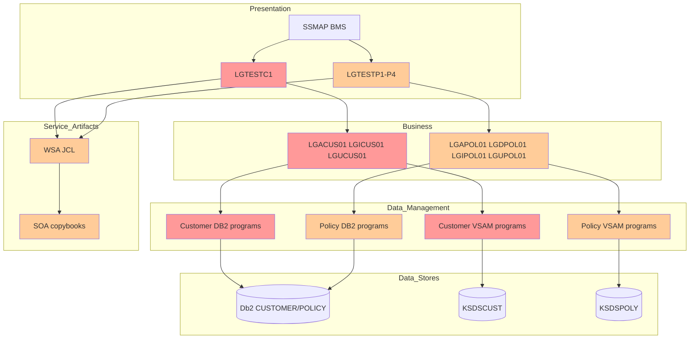

# Impact Analysis Report: Expand `CA-CUSTOMER-NUM` from 10 to 12 Digits

**Created**: 2026-06-05T02:50:40Z  
**Author**: IBM Bob Premium Package for Z AI Assistant  
**Analysis Method**: Local Workspace  
**Workspace Alignment**: Not Applicable  
**Confidence Level**: Medium

---

## 1. Change Summary

### Change Specification

**Title**: Expand [`CA-CUSTOMER-NUM`](base/src/lgcmarea.cpy:12) from 10 to 12 digits

**Type**: Enhancement

**Description**: Change the COMMAREA customer identifier field in [`lgcmarea.cpy`](base/src/lgcmarea.cpy) from `PIC 9(10)` to `PIC 9(12)` and propagate that change end-to-end across online CICS flows, Db2 persistence, VSAM persistence, screen handling, and service/interface artifacts.

**Business Objective**: Increase customer-number capacity while preserving the existing layered architecture and COMMAREA-based contract between presentation, business, and data-management programs.

### System Context

**Architecture Overview**: The application is a layered CICS COBOL application where presentation programs `LINK` to business logic, which then `LINK`s to Db2 and VSAM data-management programs. The COMMAREA defined in [`lgcmarea.cpy`](base/src/lgcmarea.cpy) is the stable cross-layer contract, as described in [`Architecture.md`](base/Architecture.md:30) and reinforced in [`AGENTS.md`](AGENTS.md).

**Key Technologies**: COBOL, CICS, Db2, VSAM, BMS maps, temporary storage queues, optional named counter service, generated web-service artifacts.

**Entry Points**: Primary online customer entry point is [`LGTESTC1`](base/src/lgtestc1.cbl). Customer add business logic is [`LGACUS01`](base/src/lgacus01.cbl), Db2 add path is [`LGACDB01`](base/src/lgacdb01.cbl), and VSAM add path is [`LGACVS01`](base/src/lgacvs01.cbl).

**Known Dependencies**:
- Shared COMMAREA copybook [`lgcmarea.cpy`](base/src/lgcmarea.cpy)
- Customer VSAM file `KSDSCUST` documented in [`Reference.md`](base/Reference.md:105)
- Db2 customer table documented in [`Architecture.md`](base/Architecture.md:105)
- Presentation maps and fields in [`LGTESTC1`](base/src/lgtestc1.cbl)
- Service-generation JCL and service copybooks under [`base/cntl/`](base/cntl/) and [`base/src/`](base/src/)

**Validated Scope Decision**: User confirmed this is an end-to-end 12-digit change across COMMAREA, Db2, VSAM keys, screens, and service interfaces, and that external contracts are in scope.

---

## 2. Scope Definition

### In Scope

Components that will be modified or directly affected:

- [`base/src/lgcmarea.cpy`](base/src/lgcmarea.cpy): Core COMMAREA contract changes from 10 to 12 digits.
- Customer presentation flow programs such as [`base/src/lgtestc1.cbl`](base/src/lgtestc1.cbl): Screen input/output handling for customer number.
- Customer business logic such as [`base/src/lgacus01.cbl`](base/src/lgacus01.cbl), [`base/src/lgicus01.cbl`](base/src/lgicus01.cbl), and [`base/src/lgucus01.cbl`](base/src/lgucus01.cbl): COMMAREA validation and orchestration.
- Customer Db2 programs such as [`base/src/lgacdb01.cbl`](base/src/lgacdb01.cbl), [`base/src/lgicdb01.cbl`](base/src/lgicdb01.cbl), and [`base/src/lgucdb01.cbl`](base/src/lgucdb01.cbl): Host variables and SQL interactions using customer number.
- Customer VSAM programs such as [`base/src/lgacvs01.cbl`](base/src/lgacvs01.cbl), [`base/src/lgicvs01.cbl`](base/src/lgicvs01.cbl), and [`base/src/lgucvs01.cbl`](base/src/lgucvs01.cbl): Record key handling and file access.
- Policy programs that read customer number from COMMAREA, including [`base/src/lgapdb01.cbl`](base/src/lgapdb01.cbl), [`base/src/lgapvs01.cbl`](base/src/lgapvs01.cbl), [`base/src/lgdpdb01.cbl`](base/src/lgdpdb01.cbl), [`base/src/lgdpvs01.cbl`](base/src/lgdpvs01.cbl), [`base/src/lgipdb01.cbl`](base/src/lgipdb01.cbl), [`base/src/lgupdb01.cbl`](base/src/lgupdb01.cbl), and related business/presentation flows.
- BMS map and screen field definitions supporting customer number entry/display, especially [`base/src/ssmap.bms`](base/src/ssmap.bms).
- Web-service assistant JCL and service copybooks, including [`base/cntl/wsaac01.jcl`](base/cntl/wsaac01.jcl), [`base/cntl/wsaic01.jcl`](base/cntl/wsaic01.jcl), and related `SOA*` copybooks in [`base/src/`](base/src/).
- Operational documentation that describes key lengths, interfaces, and sample data.

### Out of Scope

Components not expected to require direct code change, but still operationally relevant:

- Named counter infrastructure definitions themselves, such as sample JCL for NCS startup in [`base/cntl/sampncs.jcl`](base/cntl/sampncs.jcl), unless counter formatting assumptions are embedded there.
- Temporary storage queue infrastructure definitions, unless queue record layouts explicitly assume 10-digit customer numbers.
- Non-customer unrelated policy-specific business fields in [`lgcmarea.cpy`](base/src/lgcmarea.cpy).

### System Boundaries

- **External Systems**: Any consumer of generated web-service contracts or exported customer/policy layouts.
- **APIs**: Generated service interfaces derived from customer and policy copybooks.
- **Data Boundaries**: Db2 customer/policy tables, VSAM `KSDSCUST`, VSAM `KSDSPOLY`, and any queue/log records carrying customer number text.

### Functional Area

**Primary Functional Area**: Customer identity and cross-application key propagation.

**Business Function Summary**: The customer number is the primary identifier used to create, retrieve, update, and associate customer and policy records across presentation, business, Db2, and VSAM layers.

---

## 3. System Overview

### Components Analyzed

Local SQL analysis identified [`LGCMAREA`](base/src/lgcmarea.cpy) users across all major layers and found runtime usage of [`CA-CUSTOMER-NUM`](base/src/lgcmarea.cpy:12) in these programs:

| Program | Role | Observed Usage |
| --- | --- | --- |
| [`LGACDB01`](base/src/lgacdb01.cbl) | Add customer Db2 | Writes `CA-CUSTOMER-NUM` from generated Db2 identity |
| [`LGACVS01`](base/src/lgacvs01.cbl) | Add customer VSAM | Uses `CA-CUSTOMER-NUM` as record body and `RIDFLD` key |
| [`LGICDB01`](base/src/lgicdb01.cbl) | Inquire customer Db2 | Reads customer number |
| [`LGICVS01`](base/src/lgicvs01.cbl) | Inquire customer VSAM | Reads customer number |
| [`LGUCDB01`](base/src/lgucdb01.cbl) | Update customer Db2 | Reads customer number |
| [`LGUCVS01`](base/src/lgucvs01.cbl) | Update customer VSAM | Reads customer number for `READ`/`REWRITE` |
| [`LGAPDB01`](base/src/lgapdb01.cbl) | Add policy Db2 | Reads customer number |
| [`LGAPVS01`](base/src/lgapvs01.cbl) | Add policy VSAM | Reads customer number |
| [`LGDPDB01`](base/src/lgdpdb01.cbl) | Delete policy Db2 | Reads customer number |
| [`LGDPVS01`](base/src/lgdpvs01.cbl) | Delete policy VSAM | Reads customer number |
| [`LGIPDB01`](base/src/lgipdb01.cbl) | Inquire policy Db2 | Reads and writes customer number in result assembly |
| [`LGUPDB01`](base/src/lgupdb01.cbl) | Update policy Db2 | Reads customer number |
| [`LGUPVS01`](base/src/lgupvs01.cbl) | Update policy VSAM | Reads customer number |
| [`LGTESTC1`](base/src/lgtestc1.cbl) | Customer presentation | Writes and reads customer number to/from screen and TSQ control records |
| [`LGTESTP1`](base/src/lgtestp1.cbl) | Motor presentation | Reads/writes customer number |
| [`LGTESTP2`](base/src/lgtestp2.cbl) | Endowment presentation | Reads/writes customer number |
| [`LGTESTP3`](base/src/lgtestp3.cbl) | House presentation | Reads/writes customer number |
| [`LGTESTP4`](base/src/lgtestp4.cbl) | Commercial presentation | Reads/writes customer number |

### Copybook Reach

Local SQL analysis identified these direct users of [`LGCMAREA`](base/src/lgcmarea.cpy):

- [`LGACDB01`](base/src/lgacdb01.cbl)
- [`LGACUS01`](base/src/lgacus01.cbl)
- [`LGACVS01`](base/src/lgacvs01.cbl)
- [`LGAPDB01`](base/src/lgapdb01.cbl)
- [`LGAPOL01`](base/src/lgapol01.cbl)
- [`LGAPVS01`](base/src/lgapvs01.cbl)
- [`LGASTAT1`](base/src/lgastat1.cbl)
- [`LGDPDB01`](base/src/lgdpdb01.cbl)
- [`LGDPOL01`](base/src/lgdpol01.cbl)
- [`LGDPVS01`](base/src/lgdpvs01.cbl)
- [`LGICDB01`](base/src/lgicdb01.cbl)
- [`LGICUS01`](base/src/lgicus01.cbl)
- [`LGIPDB01`](base/src/lgipdb01.cbl)
- [`LGIPOL01`](base/src/lgipol01.cbl)
- [`LGTESTC1`](base/src/lgtestc1.cbl)
- [`LGTESTP1`](base/src/lgtestp1.cbl)
- [`LGTESTP2`](base/src/lgtestp2.cbl)
- [`LGTESTP3`](base/src/lgtestp3.cbl)
- [`LGTESTP4`](base/src/lgtestp4.cbl)
- [`LGUCDB01`](base/src/lgucdb01.cbl)
- [`LGUCUS01`](base/src/lgucus01.cbl)
- [`LGUCVS01`](base/src/lgucvs01.cbl)
- [`LGUPDB01`](base/src/lgupdb01.cbl)
- [`LGUPOL01`](base/src/lgupol01.cbl)
- [`LGUPVS01`](base/src/lgupvs01.cbl)

### System Context Diagram



---

## 4. Dependency Analysis

### Upstream Dependencies

Programs and artifacts that supply or originate customer number values:

- [`LGTESTC1`](base/src/lgtestc1.cbl:88) moves screen field `ENT1CNOO` into [`CA-CUSTOMER-NUM`](base/src/lgcmarea.cpy:12) for inquiry.
- [`LGTESTC1`](base/src/lgtestc1.cbl:115) initializes [`CA-CUSTOMER-NUM`](base/src/lgcmarea.cpy:12) to zero for add-customer flow.
- Policy presentation programs [`LGTESTP1`](base/src/lgtestp1.cbl), [`LGTESTP2`](base/src/lgtestp2.cbl), [`LGTESTP3`](base/src/lgtestp3.cbl), and [`LGTESTP4`](base/src/lgtestp4.cbl) also populate and consume the same COMMAREA field.
- Db2 identity generation in [`LGACDB01`](base/src/lgacdb01.cbl:281) is the authoritative source for newly assigned customer numbers when Db2 default identity is used.
- Optional named counter service described in [`Architecture.md`](base/Architecture.md:52) is another upstream source of customer-number generation logic and may impose numeric-width assumptions.

### Downstream Dependencies

Consumers of the expanded customer number:

- [`LGACVS01`](base/src/lgacvs01.cbl:68) writes `KSDSCUST` using [`CA-CUSTOMER-NUM`](base/src/lgcmarea.cpy:12) as both record source and `RIDFLD`, with explicit `KeyLength(10)` at [`lgacvs01.cbl:72`](base/src/lgacvs01.cbl:72).
- [`LGUCVS01`](base/src/lgucvs01.cbl) reads and rewrites VSAM records using the same key.
- Policy Db2 and VSAM programs consume customer number to associate policies with customers.
- Presentation programs write customer number into TSQ control records, for example [`LGTESTC1`](base/src/lgtestc1.cbl:305) and [`LGTESTC1`](base/src/lgtestc1.cbl:327).
- Generated service artifacts and copybooks will expose the field width externally.

### Internal Dependencies

#### Shared Copybook Contract

[`lgcmarea.cpy`](base/src/lgcmarea.cpy) is the central dependency. Because the architecture intentionally uses COMMAREA as the stable contract, changing [`CA-CUSTOMER-NUM`](base/src/lgcmarea.cpy:12) is a cross-family interface change, not a local field edit.

#### Length Validation Dependency

[`LGACUS01`](base/src/lgacus01.cbl:56) defines `WS-CA-HEADER-LEN` as `+18`, which matches the current fixed header:
- `CA-REQUEST-ID` = 6
- `CA-RETURN-CODE` = 2
- `CA-CUSTOMER-NUM` = 10

If [`CA-CUSTOMER-NUM`](base/src/lgcmarea.cpy:12) becomes 12 digits, the fixed header becomes 20 bytes. Therefore [`WS-CA-HEADER-LEN`](base/src/lgacus01.cbl:56) must also change or add-customer requests will fail length validation at [`LGACUS01`](base/src/lgacus01.cbl:112).

#### VSAM Key Dependency

[`Architecture.md`](base/Architecture.md:87) states the `KSDSCUST` key is the first 10 characters of each customer record. That is a structural dependency outside the COBOL field declaration itself.

#### Policy Record Dependency

[`Architecture.md`](base/Architecture.md:96) states policy VSAM keys are composed of:
- 1 character policy type
- next 10 characters customer ID
- next 10 characters policy number

A 12-digit customer number changes the physical composition of policy keys and any logic that assumes 21-character keys.

---

## 5. Impact Analysis

### Code-Level Impact

#### Primary Components

| Component | Impact Type | Specific Changes Required | Complexity |
| --- | --- | --- | --- |
| [`base/src/lgcmarea.cpy`](base/src/lgcmarea.cpy) | Modify | Change `PIC 9(10)` to `PIC 9(12)` for [`CA-CUSTOMER-NUM`](base/src/lgcmarea.cpy:12) | Low |
| [`base/src/lgacus01.cbl`](base/src/lgacus01.cbl) | Modify | Update [`WS-CA-HEADER-LEN`](base/src/lgacus01.cbl:56) from 18 to 20; review any commarea-length assumptions | Medium |
| [`base/src/lgacdb01.cbl`](base/src/lgacdb01.cbl) | Modify | Ensure Db2 host variable and generated identity handling support 12 digits; verify target column precision | Medium |
| [`base/src/lgacvs01.cbl`](base/src/lgacvs01.cbl) | Modify | Change `RIDFLD`/record assumptions and `KeyLength(10)` at [`lgacvs01.cbl:72`](base/src/lgacvs01.cbl:72) | High |
| [`base/src/lgtestc1.cbl`](base/src/lgtestc1.cbl) | Modify | Expand screen field handling and TSQ message layouts carrying customer number | High |
| [`base/src/lgicdb01.cbl`](base/src/lgicdb01.cbl) | Modify | Update customer-number host variable precision and retrieval logic | Medium |
| [`base/src/lgicvs01.cbl`](base/src/lgicvs01.cbl) | Modify | Update VSAM key handling for inquiry | High |
| [`base/src/lgucdb01.cbl`](base/src/lgucdb01.cbl) | Modify | Update customer-number precision in update path | Medium |
| [`base/src/lgucvs01.cbl`](base/src/lgucvs01.cbl) | Modify | Update VSAM `READ`/`REWRITE` key handling | High |
| [`base/src/lgapdb01.cbl`](base/src/lgapdb01.cbl) | Modify | Update policy/customer association precision | Medium |
| [`base/src/lgapvs01.cbl`](base/src/lgapvs01.cbl) | Modify | Update policy VSAM key composition | High |
| [`base/src/lgdpdb01.cbl`](base/src/lgdpdb01.cbl) | Modify | Update delete path precision | Medium |
| [`base/src/lgdpvs01.cbl`](base/src/lgdpvs01.cbl) | Modify | Update VSAM key composition | High |
| [`base/src/lgipdb01.cbl`](base/src/lgipdb01.cbl) | Modify | Update inquiry result assembly where customer number is moved back into COMMAREA | Medium |
| [`base/src/lgupdb01.cbl`](base/src/lgupdb01.cbl) | Modify | Update update path precision | Medium |
| [`base/src/lgupvs01.cbl`](base/src/lgupvs01.cbl) | Modify | Update VSAM key composition | High |
| [`base/src/lgtestp1.cbl`](base/src/lgtestp1.cbl) | Modify | Expand customer-number screen handling | Medium |
| [`base/src/lgtestp2.cbl`](base/src/lgtestp2.cbl) | Modify | Expand customer-number screen handling | Medium |
| [`base/src/lgtestp3.cbl`](base/src/lgtestp3.cbl) | Modify | Expand customer-number screen handling | Medium |
| [`base/src/lgtestp4.cbl`](base/src/lgtestp4.cbl) | Modify | Expand customer-number screen handling | Medium |
| [`base/src/ssmap.bms`](base/src/ssmap.bms) | Modify | Increase customer-number field lengths on maps | High |
| [`base/src/soaic01.cpy`](base/src/soaic01.cpy) and related `SOA*` copybooks | Modify | Regenerate or update service layouts to 12-digit customer number | Medium |
| [`base/cntl/wsaac01.jcl`](base/cntl/wsaac01.jcl), [`base/cntl/wsaic01.jcl`](base/cntl/wsaic01.jcl), [`base/cntl/wsaap01.jcl`](base/cntl/wsaap01.jcl), [`base/cntl/wsaip01.jcl`](base/cntl/wsaip01.jcl) | Modify/Regenerate | Re-run or adjust web-service assistant generation for changed layouts | Medium |

### Application-Level Impact

#### Interface Changes

This is a breaking interface change for every program that includes [`LGCMAREA`](base/src/lgcmarea.cpy). Even where the field is not directly referenced, offsets of subsequent fields in the COMMAREA header change by 2 bytes.

#### Data Contract Changes

- COMMAREA header length changes from 18 to 20 bytes.
- Any caller/callee pair using fixed positional assumptions or copied layouts must be recompiled together.
- Service contracts generated from copybooks become externally incompatible with prior 10-digit consumers unless versioned.

#### Batch/Operational Flow Impact

Although the primary request is online, workload simulator and generated service flows may also embed customer-number width assumptions. Files under [`base/wsim/`](base/wsim/) should be treated as at-risk test and simulation dependencies.

### System-Level Impact

#### Db2 Schema Impact

The customer table currently stores customer number and is used as the authoritative identifier. Because [`LGACDB01`](base/src/lgacdb01.cbl:285) moves a Db2-generated value into [`CA-CUSTOMER-NUM`](base/src/lgcmarea.cpy:12), the Db2 column definition and identity precision must support 12 digits.

Likely impacts:
- Alter `CUSTOMERNUMBER` precision if currently defined as 10 digits.
- Review foreign-key columns in policy tables that reference customer number.
- Review indexes, constraints, and any SQL host variable definitions.

#### VSAM Schema Impact

This is the highest-risk area.

- [`Architecture.md`](base/Architecture.md:87) states `KSDSCUST` uses the first 10 characters as key.
- [`lgacvs01.cbl`](base/src/lgacvs01.cbl:72) hardcodes `KeyLength(10)`.
- [`Architecture.md`](base/Architecture.md:96) states policy keys embed a 10-character customer ID inside a 21-character composite key.

Therefore:
- `KSDSCUST` record layout and key definition must change.
- `KSDSPOLY` composite key layout must change.
- Corresponding CICS FILE definitions and dataset definitions may need regeneration/reload.
- Existing VSAM data may require unload/transform/reload migration.

#### External Contract Impact

Generated service artifacts and any external consumers of customer or policy inquiry/add services will need coordinated contract updates.

### Operational Impact

#### Build and Deployment

Because this repository is deployment-documentation-first, operational changes likely include:
- Updating source members in [`base/src/`](base/src/)
- Potentially updating Db2 DDL jobs such as [`base/cntl/db2cre.jcl`](base/cntl/db2cre.jcl)
- Potentially updating dataset definition/load jobs such as [`base/cntl/adef121.jcl`](base/cntl/adef121.jcl)
- Recompiling all impacted COBOL programs via [`base/cntl/cobol.jcl`](base/cntl/cobol.jcl)
- Reassembling BMS maps
- Regenerating web-service artifacts

#### Runtime

- Existing 10-digit data remains numerically valid but may require zero-padding or migration strategy decisions.
- Mixed 10-digit and 12-digit runtime coexistence is risky unless all layers are deployed in a coordinated cutover.

---

## 6. Change Propagation Map

### Change Propagation Diagram

```mermaid
graph TD
    A[Change CA-CUSTOMER-NUM to 9(12)] --> B[LGCMAREA copybook offsets change]
    B --> C[Presentation programs recompile]
    B --> D[Business logic recompile]
    B --> E[DB2 programs recompile]
    B --> F[VSAM programs recompile]
    B --> G[Service copybooks regenerate]

    D --> H[LGACUS01 header length changes 18 to 20]
    E --> I[DB2 customer and policy schema review]
    F --> J[KSDSCUST key changes 10 to 12]
    F --> K[KSDSPOLY composite key changes]
    C --> L[BMS map field lengths expand]
    C --> M[TSQ message layouts reviewed]
    G --> N[External service contracts change]

    J --> O[VSAM data migration]
    K --> O
    I --> P[DB2 DDL migration]
    L --> Q[Map reassembly and UI regression]
    N --> R[Consumer coordination]

    style A fill:#ff0000,color:#fff
    style J fill:#ff9999
    style K fill:#ff9999
    style I fill:#ffcc99
    style N fill:#ffcc99
    style O fill:#ff9999
```

### Detailed Propagation Paths

#### Path 1: COMMAREA Contract

[`CA-CUSTOMER-NUM`](base/src/lgcmarea.cpy:12) width change  
→ COMMAREA header grows by 2 bytes  
→ [`LGACUS01`](base/src/lgacus01.cbl:56) length constant becomes invalid  
→ add-customer validation and all callers/callees must be recompiled together

#### Path 2: Customer Persistence

[`LGACDB01`](base/src/lgacdb01.cbl:285) writes 12-digit value to COMMAREA  
→ [`LGACVS01`](base/src/lgacvs01.cbl:68) uses same value as VSAM key  
→ `KSDSCUST` key definition changes  
→ dataset/file definitions and migration required

#### Path 3: Policy Association

Policy programs read customer number from COMMAREA  
→ policy Db2 foreign keys and host variables must expand  
→ `KSDSPOLY` composite key customer segment changes from 10 to 12  
→ policy VSAM key length and parsing logic change

#### Path 4: Presentation and Services

[`LGTESTC1`](base/src/lgtestc1.cbl:138) moves customer number to screen field  
→ BMS map field lengths must expand  
→ service copybooks and WSA-generated artifacts must regenerate  
→ external consumers must adapt to new contract

---

## 7. Risk Assessment

| Risk ID | Description | Category | Likelihood | Impact | Risk Level | Mitigation Strategy |
| --- | --- | --- | --- | --- | --- | --- |
| R1 | COMMAREA header-length mismatch causes immediate add-customer failures in [`LGACUS01`](base/src/lgacus01.cbl) | Runtime Failure | High | High | **HIGH** | Update [`WS-CA-HEADER-LEN`](base/src/lgacus01.cbl:56) and regression-test all COMMAREA validation paths |
| R2 | `KSDSCUST` key remains 10 while programs send 12-digit keys | Data Integrity | High | High | **HIGH** | Redefine VSAM file layout and CICS file usage together; migrate data before cutover |
| R3 | `KSDSPOLY` composite key logic breaks because customer segment expands from 10 to 12 | Data Integrity | High | High | **HIGH** | Redesign composite key layout and update all policy VSAM programs consistently |
| R4 | Db2 schema precision remains 10 digits, causing insert/update failures or truncation | Data Integrity | Medium | High | **HIGH** | Review and alter customer and related policy columns before application deployment |
| R5 | BMS maps and screen fields remain 10 characters, truncating input/output | Regression | High | Medium | **HIGH** | Update [`ssmap.bms`](base/src/ssmap.bms), reassemble maps, and run UI regression |
| R6 | External service consumers break due to regenerated 12-digit contracts | Hidden Dependency | Medium | High | **HIGH** | Version or coordinate service contract rollout and notify consumers |
| R7 | TSQ/log/control record layouts still assume 10-digit customer numbers | Hidden Dependency | Medium | Medium | **MEDIUM** | Review queue message layouts in presentation and support programs |
| R8 | Existing sample/test/workload data and scripts become inconsistent with new key lengths | Operational | Medium | Medium | **MEDIUM** | Update simulator inputs, sample data, and test scripts |
| R9 | Partial deployment across layers causes mixed 10/12-digit behavior | Operational | High | High | **HIGH** | Use coordinated cutover with schema, file, map, and program deployment sequence |
| R10 | Named counter or identity-generation assumptions cap values below 12 digits | Functionality | Low | Medium | **LOW** | Validate generator precision and formatting rules before implementation |

### Critical Risks

1. **VSAM structural impact** is the dominant risk because both customer and policy files embed 10-character customer identifiers today.
2. **COMMAREA contract drift** is the fastest failure mode because a 2-byte header change affects validation and offsets immediately.
3. **External contract breakage** is significant because the user confirmed service interfaces are in scope.

---

## 8. Assumptions and Unknowns

### Confirmed Assumptions

- The change is end-to-end, not COMMAREA-only.
- Db2, VSAM, screens, and service interfaces are all in scope.
- Final report should rely on local analysis only.

### Remaining Unknowns

- Exact Db2 DDL definitions for customer and policy customer-number columns were not read in this analysis.
- Exact BMS field names and lengths in [`ssmap.bms`](base/src/ssmap.bms) were not inspected directly in this pass.
- Exact service copybooks and generated XML/schema field names were not individually enumerated.
- Existing migration strategy for 10-digit VSAM and Db2 data is not yet defined.

---

## 9. Confidence Assessment

### Overall Confidence: Medium

### Justification

High-confidence areas:
- Local SQL analysis clearly identified broad copybook reach and runtime usage of [`CA-CUSTOMER-NUM`](base/src/lgcmarea.cpy:12).
- Direct source review confirmed critical impacts in [`LGACUS01`](base/src/lgacus01.cbl:56), [`LGACDB01`](base/src/lgacdb01.cbl:285), [`LGACVS01`](base/src/lgacvs01.cbl:72), and [`LGTESTC1`](base/src/lgtestc1.cbl:138).
- Architecture documentation explicitly confirms 10-character VSAM key assumptions in [`Architecture.md`](base/Architecture.md:87) and [`Architecture.md`](base/Architecture.md:96).

Lower-confidence areas:
- Db2 DDL and service artifact details were inferred from program usage and repository structure rather than fully enumerated.
- Some downstream operational artifacts may contain additional hidden 10-digit assumptions.

---

## 10. Effort and Complexity View

### Estimated Complexity by Area

| Area | Complexity | Notes |
| --- | --- | --- |
| COMMAREA and business logic | Medium | Straightforward field and length updates, but cross-program recompilation required |
| Db2 schema and SQL host variables | Medium | Depends on current column precision and referential relationships |
| VSAM customer file | High | Key-length and record-layout change |
| VSAM policy file | High | Composite key redesign required |
| Presentation/BMS | Medium-High | Screen field expansion and regression |
| Service artifacts | Medium | Regeneration and consumer coordination |
| Data migration/testing | High | Requires coordinated cutover and regression across layers |

---

## 11. Recommended Next Steps

1. Inspect and document exact Db2 DDL in [`base/cntl/db2cre.jcl`](base/cntl/db2cre.jcl) and related SQL definitions.
2. Inspect [`base/src/ssmap.bms`](base/src/ssmap.bms) for all customer-number field lengths and map names.
3. Inventory all `SOA*` copybooks and WSA jobs that expose customer number externally.
4. Create a phased implementation plan covering:
   - copybook and program changes
   - Db2 schema changes
   - VSAM dataset/key migration
   - BMS regeneration
   - service regeneration
   - coordinated deployment and rollback
5. Define migration rules for existing 10-digit customer numbers, including whether they remain left-padded/right-justified or are transformed to 12-digit canonical values.

---

## Appendix A: Key Evidence

- [`CA-CUSTOMER-NUM PIC 9(10)`](base/src/lgcmarea.cpy:12)
- [`WS-CA-HEADER-LEN PIC S9(4) COMP VALUE +18`](base/src/lgacus01.cbl:56)
- [`IF EIBCALEN IS LESS THAN WS-REQUIRED-CA-LEN`](base/src/lgacus01.cbl:112)
- [`MOVE DB2-CUSTOMERNUM-INT TO CA-CUSTOMER-NUM`](base/src/lgacdb01.cbl:285)
- [`RIDFLD(CA-Customer-Num)`](base/src/lgacvs01.cbl:71)
- [`KeyLength(10)`](base/src/lgacvs01.cbl:72)
- [`Move CA-CUSTOMER-NUM To ENT1CNOI`](base/src/lgtestc1.cbl:138)
- [`Move CA-Customer-Num To Write-Msg-High`](base/src/lgtestc1.cbl:305)
- [`The key for the KSDSCUST VSAM file is the first 10 characters`](base/Architecture.md:87)
- [`The next 10 characters are the customer ID`](base/Architecture.md:96)

---

## Appendix B: Local Analysis Summary

The local TMI database identified 25 direct users of [`LGCMAREA`](base/src/lgcmarea.cpy) and runtime references to [`CA-CUSTOMER-NUM`](base/src/lgcmarea.cpy:12) across customer add/inquire/update, policy add/delete/inquire/update, and all presentation programs. This confirms the change propagates beyond customer-add logic into policy and UI/service flows.

---

**End of Impact Analysis Report**