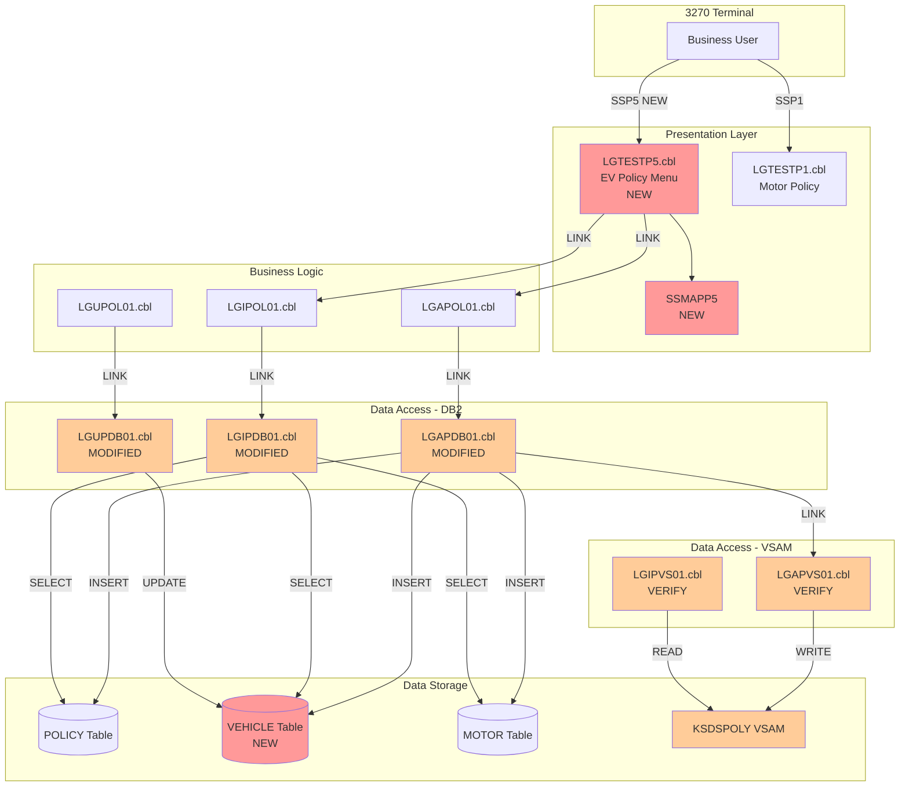
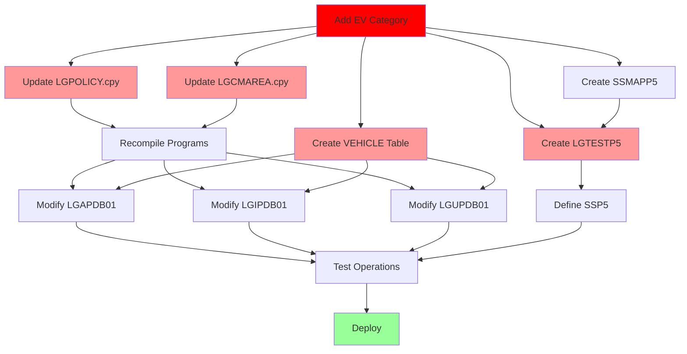

# Impact Analysis Report: Add Electric Vehicle Insurance Policy Category

**Created**: 2026-06-05T02:56:36Z
**Author**: IBM Bob Premium Package for Z AI Assistant
**Analysis Method**: Local Workspace
**Workspace Alignment**: Fully Aligned
**Confidence Level**: High

---

## 1. Change Summary

### Change Specification

**Title**: Add Electric Vehicle Insurance Policy Category

**Type**: Enhancement

**Description**: Add a new insurance policy type for electric vehicles (EVs) to the GenApp insurance application. The new policy type will follow the same structure as the existing Motor policy but will be designated with policy type code 'V' (for Vehicle) to distinguish electric vehicles from traditional motor vehicles.

**Business Objective**: Expand the insurance product portfolio to support the growing electric vehicle market, enabling the company to offer specialized insurance coverage for electric vehicles while maintaining consistency with existing motor insurance processes.

### System Context

**Architecture Overview**: 3-tier CICS COBOL application with presentation, business logic, and data access layers

**Key Technologies**: COBOL, DB2, VSAM, CICS, BMS (3270 interface)

**Entry Points**: 
- New transaction SSP5 (to be created) for electric vehicle policy management
- New presentation program LGTESTP5 (to be created)
- Existing business logic programs (LGAPOL01, LGIPOL01, LGUPOL01, LGDPOL01) - no changes needed
- Existing data access programs (LGAPDB01, LGIPDB01, LGUPDB01, LGDPDB01) - to be modified

**Known Dependencies**: 
- [`lgpolicy.cpy`](base/src/lgpolicy.cpy) copybook (policy data structures)
- [`lgcmarea.cpy`](base/src/lgcmarea.cpy) copybook (communication area)
- DB2 tables: POLICY, new VEHICLE table
- VSAM files: KSDSPOLY (policy records)

---

## 2. Scope Definition

### In Scope

Components that WILL be modified or directly affected:

- **New Components**:
  - LGTESTP5.cbl - New presentation program for EV policy menu (to be created)
  - VEHICLE DB2 table - New table for EV policy details (to be created)
  - Transaction SSP5 - New CICS transaction definition (to be created)
  - BMS map SSMAPP5 - New 3270 screen map (to be created)

- **Modified Components**:
  - [`lgpolicy.cpy`](base/src/lgpolicy.cpy) - Add DB2-VEHICLE structure
  - [`lgcmarea.cpy`](base/src/lgcmarea.cpy) - Add CA-VEHICLE structure
  - [`lgapdb01.cbl`](base/src/lgapdb01.cbl) - Add INSERT logic for VEHICLE table
  - [`lgipdb01.cbl`](base/src/lgipdb01.cbl) - Add SELECT logic for VEHICLE table
  - [`lgupdb01.cbl`](base/src/lgupdb01.cbl) - Add UPDATE logic for VEHICLE table
  - [`lgdpdb01.cbl`](base/src/lgdpdb01.cbl) - Add DELETE logic for VEHICLE table
  - [`lgapvs01.cbl`](base/src/lgapvs01.cbl) - Verify VSAM write logic for 'V' policy type
  - [`lgipvs01.cbl`](base/src/lgipvs01.cbl) - Verify VSAM read logic for 'V' policy type
  - [`lgupvs01.cbl`](base/src/lgupvs01.cbl) - Verify VSAM update logic for 'V' policy type
  - [`lgdpvs01.cbl`](base/src/lgdpvs01.cbl) - Verify VSAM delete logic for 'V' policy type
  - KSDSPOLY VSAM file - Will store 'V' type policy records

### Out of Scope

Components that will NOT be changed:

- [`lgapol01.cbl`](base/src/lgapol01.cbl) - Business logic layer (handles all policy types generically)
- [`lgipol01.cbl`](base/src/lgipol01.cbl) - Business logic layer (no changes needed)
- [`lgupol01.cbl`](base/src/lgupol01.cbl) - Business logic layer (no changes needed)
- [`lgdpol01.cbl`](base/src/lgdpol01.cbl) - Business logic layer (no changes needed)
- Customer management programs (LGACUS01, LGICUS01, LGUCUS01)
- Other policy types (Endowment, House, Motor, Commercial)
- CUSTOMER table and related programs

### System Boundaries

- **External Systems**: No external system integration required
- **APIs**: No API changes (application is 3270-based)
- **Data Boundaries**: Changes limited to POLICY, VEHICLE tables and KSDSPOLY VSAM file

### Functional Area

**Primary Functional Area**: Policy Management - Insurance Product Portfolio

**Business Function Summary**: Extends the insurance policy management system to support a new product line for electric vehicle insurance, following the established pattern of motor vehicle insurance but with a distinct policy type identifier.

---

## 3. System Overview

### System Context Diagram



**Legend**:
- 🔴 Red: New components
- 🟠 Orange: Modified components
- ⚪ White: Existing (no changes)

### Components Analyzed

**Total Programs**: 31 COBOL programs analyzed

**Programs Requiring Changes**: 8 programs + 1 new program

**Key Programs**:

| Program      | Description                | Workspace Status | Impact Level |
|--------------|----------------------------|------------------|--------------|
| LGTESTP5.cbl | EV policy menu (NEW)       | To be created    | High         |
| LGAPDB01.cbl | Add policy to DB2          | Available        | High         |
| LGIPDB01.cbl | Inquire policy from DB2    | Available        | High         |
| LGUPDB01.cbl | Update policy in DB2       | Available        | Medium       |
| LGDPDB01.cbl | Delete policy from DB2     | Available        | Low          |
| LGAPVS01.cbl | Add policy to VSAM         | Available        | Low          |
| LGIPVS01.cbl | Inquire policy from VSAM   | Available        | Low          |
| LGUPVS01.cbl | Update policy in VSAM      | Available        | Low          |
| LGDPVS01.cbl | Delete policy from VSAM    | Available        | Low          |

**Database Tables**:

| Table/File   | Purpose                  | Access Type | Impact Level |
|--------------|--------------------------|-------------|--------------|
| POLICY       | Policy master records    | Read/Write  | Medium       |
| VEHICLE      | EV policy details (NEW)  | Read/Write  | High         |
| MOTOR        | Motor policy details     | Read/Write  | None         |
| KSDSPOLY     | VSAM policy file         | Read/Write  | Low          |

---

## 4. Dependency Analysis

### Upstream Dependencies

#### Input Programs

| Component    | Relationship   | Data Provided    | Impact                              |
|--------------|----------------|------------------|-------------------------------------|
| LGTESTP5.cbl | Calls LGAPOL01 | EV policy data   | New program passes 'V' policy type  |
| LGTESTP5.cbl | Calls LGIPOL01 | Policy inquiry   | New program handles 'V' type        |

#### Input Data Sources

| Source        | Type     | Data Provided   | Impact                        |
|---------------|----------|-----------------|-------------------------------|
| 3270 Terminal | BMS Map  | User input      | New SSMAPP5 map for EV data   |
| POLICY table  | Database | Policy header   | Must support 'V' policy type  |

### Downstream Dependencies

#### Output Programs

| Component    | Relationship       | Data Consumed   | Impact                            |
|--------------|--------------------|-----------------|-----------------------------------|
| LGAPDB01.cbl | Called by LGAPOL01 | EV policy data  | Must INSERT to VEHICLE table      |
| LGIPDB01.cbl | Called by LGIPOL01 | Policy inquiry  | Must SELECT from VEHICLE table    |
| LGUPDB01.cbl | Called by LGUPOL01 | Policy update   | Must UPDATE VEHICLE table         |

#### Output Data Destinations

| Destination   | Type     | Data Written    | Impact                        |
|---------------|----------|-----------------|-------------------------------|
| POLICY table  | Database | Policy header   | Add 'V' as valid policy type  |
| VEHICLE table | Database | EV details      | New table to be created       |
| KSDSPOLY VSAM | VSAM     | Policy records  | Must handle 'V' prefix        |

### Internal Dependencies

#### Copybooks

| Copybook     | Used By             | Purpose              | Impact                    |
|--------------|---------------------|----------------------|---------------------------|
| LGPOLICY.cpy | All policy programs | Policy structures    | Add DB2-VEHICLE structure |
| LGCMAREA.cpy | All programs        | Communication area   | Add CA-VEHICLE structure  |

---

## 5. Impact Analysis

### Code-Level Impact

#### LGPOLICY.cpy (MODIFIED)

**Impact Type**: Modify

**Changes Required**:
1. Add DB2-VEHICLE structure (similar to DB2-MOTOR)
2. Add WS-VEHICLE-LEN constant
3. Add WS-FULL-VEHICLE-LEN constant

**Complexity**: Low
**Lines Affected**: ~15 lines (additions)
**Ripple Effect**: All programs using this copybook must be recompiled

---

#### LGCMAREA.cpy (MODIFIED)

**Impact Type**: Modify

**Changes Required**:
1. Add CA-VEHICLE structure (redefines CA-POLICY-SPECIFIC)
2. Mirror DB2-VEHICLE field structure

**Complexity**: Low
**Lines Affected**: ~12 lines (additions)
**Ripple Effect**: All programs using this copybook must be recompiled

---

#### LGAPDB01.cbl (MODIFIED)

**Impact Type**: Modify

**Changes Required**:
1. Add host variables for VEHICLE table
2. Add EVALUATE case for 'V' policy type
3. Add SQL INSERT for VEHICLE table
4. Add error handling for VEHICLE operations

**Complexity**: Medium
**Lines Affected**: ~60 lines (additions)

---

#### LGIPDB01.cbl (MODIFIED)

**Impact Type**: Modify

**Changes Required**:
1. Add host variables for VEHICLE table
2. Add EVALUATE case for 'V' policy type
3. Add SQL SELECT from VEHICLE table
4. Move data to CA-VEHICLE structure

**Complexity**: Medium
**Lines Affected**: ~50 lines (additions)

---

#### LGUPDB01.cbl (MODIFIED)

**Impact Type**: Modify

**Changes Required**:
1. Add host variables for VEHICLE table
2. Add EVALUATE case for 'V' policy type
3. Add SQL UPDATE for VEHICLE table

**Complexity**: Medium
**Lines Affected**: ~40 lines (additions)

---

#### LGDPDB01.cbl (MODIFIED)

**Impact Type**: Modify

**Changes Required**:
1. Add EVALUATE case for 'V' policy type
2. Add SQL DELETE for VEHICLE table

**Complexity**: Low
**Lines Affected**: ~20 lines (additions)

---

#### LGAPVS01.cbl, LGIPVS01.cbl, LGUPVS01.cbl, LGDPVS01.cbl (VERIFY)

**Impact Type**: Verify

**Changes Required**:
- Verify VSAM key construction handles 'V' policy type
- Likely no code changes needed (generic implementation)

**Complexity**: Low
**Lines Affected**: 0-5 lines (verification only)

---

#### LGTESTP5.cbl (NEW)

**Impact Type**: Create

**Changes Required**:
1. Create new program based on LGTESTP1.cbl template
2. Use CA-VEHICLE structure
3. Map BMS fields to CA-V-* fields
4. Handle request IDs: '01IVEH', '01AVEH', '01UVEH', '01DVEH'

**Complexity**: Medium
**Lines Affected**: ~150 lines (new program)

---

### Application-Level Impact

#### Interface Changes

| Interface        | Change              | Affected Programs | Impact          |
|------------------|---------------------|-------------------|-----------------|
| LGPOLICY copybook| Add DB2-VEHICLE     | All policy progs  | Recompile all   |
| LGCMAREA copybook| Add CA-VEHICLE      | All programs      | Recompile all   |

#### Data Contract Changes

| Contract      | Change            | Affected Components | Impact        |
|---------------|-------------------|---------------------|---------------|
| LGPOLICY.cpy  | Add VEHICLE       | All policy programs | Recompile all |
| LGCMAREA.cpy  | Add CA-VEHICLE    | All programs        | Recompile all |

---

### System-Level Impact

#### Database Schema Changes

**VEHICLE Table (NEW)**:

```sql
CREATE TABLE VEHICLE
(
    POLICYNUMBER    INTEGER NOT NULL,
    MAKE            VARCHAR(15),
    MODEL           VARCHAR(15),
    VALUE           INTEGER,
    REGNUMBER       VARCHAR(7),
    COLOUR          VARCHAR(8),
    CC              SMALLINT,
    MANUFACTURED    VARCHAR(10),
    PREMIUM         INTEGER,
    ACCIDENTS       INTEGER,
    PRIMARY KEY (POLICYNUMBER),
    FOREIGN KEY (POLICYNUMBER) REFERENCES POLICY(POLICYNUMBER)
        ON DELETE CASCADE
);

CREATE INDEX IDX_VEHICLE_MAKE ON VEHICLE(MAKE);
CREATE INDEX IDX_VEHICLE_MODEL ON VEHICLE(MODEL);
```

**Impact**:
- New table creation requires DBA coordination
- Foreign key ensures referential integrity
- No data migration required (new policy type)

---

### Operational Impact

**Build/Deployment**:
1. Create VEHICLE table in DB2
2. Update and compile copybooks
3. Compile modified programs
4. Assemble BMS map SSMAPP5
5. Compile new program LGTESTP5
6. Define CICS transaction SSP5
7. Install to CICS region
8. Test with SSP5 transaction

**Runtime**:
- Minimal performance impact
- New VEHICLE table adds one DB2 access per EV policy operation
- VSAM file grows with 'V' type policies

---

## 6. Change Propagation Map



---

## 7. Risk Assessment

| Risk ID | Description                              | Category       | Likelihood | Impact | Risk Level | Mitigation                                    |
|---------|------------------------------------------|----------------|------------|--------|------------|-----------------------------------------------|
| R1      | Copybook changes break existing programs | Regression     | Low        | High   | MEDIUM     | Comprehensive regression testing              |
| R2      | VEHICLE table foreign key issues         | Data Integrity | Low        | High   | MEDIUM     | Test referential integrity thoroughly         |
| R3      | VSAM key collision                       | Data Integrity | Low        | Medium | LOW        | Verify 'V' prefix is unique                   |
| R4      | BMS map compilation errors               | Runtime        | Medium     | Medium | MEDIUM     | Test map assembly in test region first        |
| R5      | DB2 bind plan issues                     | Runtime        | Medium     | High   | MEDIUM     | Rebind packages; test in non-prod             |
| R6      | Two-phase commit issues                  | Data Integrity | Low        | High   | MEDIUM     | Test commit coordination thoroughly           |
| R7      | Incomplete error handling                | Runtime        | Medium     | Medium | MEDIUM     | Add comprehensive error handling              |
| R8      | Documentation gaps                       | Operational    | High       | Low    | MEDIUM     | Update documentation; train support staff     |

---

## 8. Confidence Assessment

### Overall Confidence: High

**Strengths**:
- ✅ Application architecture well understood
- ✅ Existing policy types provide clear template
- ✅ All source code available
- ✅ Database schema impact clearly defined
- ✅ Change follows established pattern

**Weaknesses**:
- ⚠️ BMS map creation requires testing
- ⚠️ DB2 bind process needs DBA coordination
- ⚠️ Two-phase commit testing required

**Confidence by Category**:

| Category              | Confidence | Reason                                  |
|-----------------------|------------|-----------------------------------------|
| Code-Level Impact     | High       | All programs analyzed in detail         |
| Application Impact    | High       | Clear copybook dependencies             |
| System Impact         | High       | Database schema well defined            |
| Operational Impact    | Medium     | Deployment coordination required        |
| Risk Assessment       | High       | Comprehensive risk identification       |

---

## 9. Effort Estimation

| Component       | Complexity | Estimated Effort | Dependencies        |
|-----------------|------------|------------------|---------------------|
| LGPOLICY.cpy    | Low        | 1 hour           | None                |
| LGCMAREA.cpy    | Low        | 1 hour           | None                |
| LGAPDB01.cbl    | Medium     | 4-6 hours        | Copybooks, DB       |
| LGIPDB01.cbl    | Medium     | 4-6 hours        | Copybooks, DB       |
| LGUPDB01.cbl    | Medium     | 3-4 hours        | Copybooks, DB       |
| LGDPDB01.cbl    | Low        | 2 hours          | Copybooks, DB       |
| VSAM programs   | Low        | 2-3 hours        | Verification        |
| LGTESTP5.cbl    | Medium     | 6-8 hours        | BMS map             |
| SSMAPP5 map     | Low        | 2-3 hours        | None                |
| VEHICLE table   | Low        | 2 hours          | DBA coordination    |
| Testing         | High       | 16-24 hours      | All components      |
| Documentation   | Low        | 4-6 hours        | All components      |

**Total Effort**: 47-66 hours (6-8 days)

**Critical Path**: 7-9 days

---

## 10. Next Steps

### Immediate Actions

1. **Review and Approve**: Review this impact analysis with technical lead and stakeholders
2. **Coordinate with DBA**: Schedule VEHICLE table creation and DB2 bind coordination
3. **Create Implementation Plan**: Use implementation-planning skill for detailed execution plan

### Before Implementation

1. **Set Up Test Environment**: Prepare test data and test CICS region
2. **Create Test Cases**: Define test scenarios for all CRUD operations
3. **Schedule Deployment**: Coordinate deployment window with operations team

### During Implementation

1. **Follow Change Sequence**: Execute changes in defined order
2. **Test Each Component**: Test after each modification
3. **Monitor Progress**: Track status and escalate blockers

---

## Appendix A: Analysis Data

### Programs Analyzed

**Policy Management Programs**:
- LGAPDB01, LGIPDB01, LGUPDB01, LGDPDB01 (DB2 access)
- LGAPVS01, LGIPVS01, LGUPVS01, LGDPVS01 (VSAM access)
- LGAPOL01, LGIPOL01, LGUPOL01, LGDPOL01 (Business logic)
- LGTESTP1, LGTESTP2, LGTESTP3, LGTESTP4 (Presentation)

### Database Tables

**Existing Tables**:
- POLICY (19 accesses: 10 reads, 9 writes)
- MOTOR (3 accesses: 1 read, 2 writes)
- HOUSE (3 accesses: 1 read, 2 writes)
- ENDOWMENT (4 accesses: 1 read, 3 writes)
- COMMERCIAL (9 accesses: 4 reads, 5 writes)

**New Table**:
- VEHICLE (to be created, similar to MOTOR)

### Call Hierarchy

```
LGTESTP5 (NEW)
  └── LGAPOL01 → LGAPDB01 → LGAPVS01 → KSDSPOLY
  └── LGIPOL01 → LGIPDB01 → LGIPVS01 → KSDSPOLY
  └── LGUPOL01 → LGUPDB01 → LGUPVS01 → KSDSPOLY
  └── LGDPOL01 → LGDPDB01 → LGDPVS01 → KSDSPOLY
```

---

**End of Impact Analysis Report**