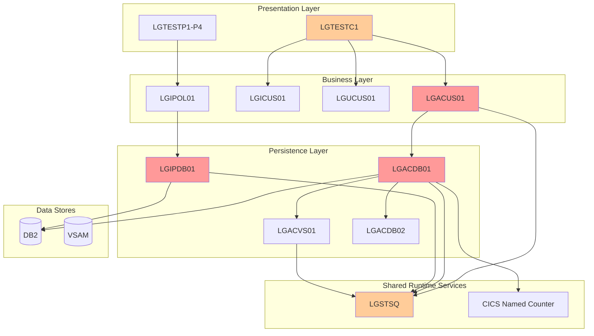
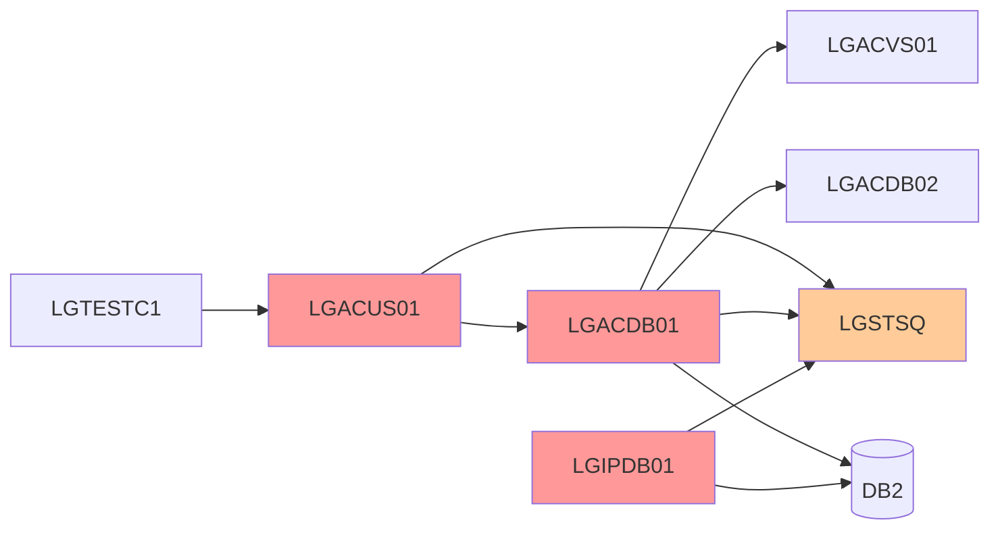
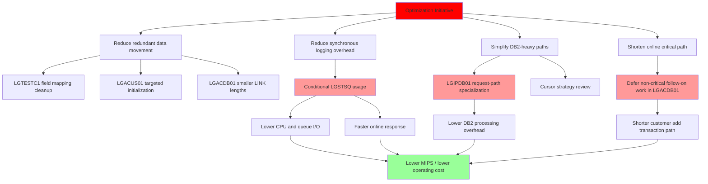

# Impact Analysis Report: Mainframe Performance Optimization and Cost Reduction

**Created**: 2026-06-18T21:14:27Z  
**Author**: IBM Bob Premium Package for Z AI Assistant  
**Analysis Method**: Local Workspace  
**Workspace Alignment**: Not Applicable  
**Confidence Level**: Medium

---

## 1. Change Summary

### Change Specification

**Title**: Mainframe Performance Optimization and Cost Reduction

**Type**: Refactor

**Description**: Analyze the existing CICS COBOL application to identify inefficient execution paths, redundant logic, excessive runtime overhead, and suboptimal processing patterns. Recommend optimized code structures that preserve business behavior while reducing CPU consumption, improving throughput, and lowering operating cost.

**Business Objective**: Reduce MIPS consumption, lower ongoing mainframe operating costs, improve online transaction response time, extend the useful life of the current z/OS application assets, and prepare the codebase for future modernization without a full rewrite.

### System Context

**Architecture Overview**: The application follows a layered CICS design in which presentation programs such as [`LGTESTC1`](base/src/lgtestc1.cbl) invoke business orchestration programs such as [`LGACUS01`](base/src/lgacus01.cbl), which then invoke persistence programs such as [`LGACDB01`](base/src/lgacdb01.cbl). Policy inquiry follows a similar layered pattern with [`LGIPDB01`](base/src/lgipdb01.cbl) acting as a DB2-heavy retrieval component. Shared COMMAREA contracts are defined through [`LGCMAREA`](base/src/lgcmarea.cpy) and business structures through [`LGPOLICY`](base/src/lgpolicy.cpy).

**Key Technologies**: COBOL, CICS, DB2, VSAM, COMMAREA-based inter-program communication, CICS named counter service, temporary-storage/queue-based diagnostics.

**Entry Points**: [`LGTESTC1`](base/src/lgtestc1.cbl), [`LGTESTP1`](base/src/lgtestp1.cbl), [`LGTESTP2`](base/src/lgtestp2.cbl), [`LGTESTP3`](base/src/lgtestp3.cbl), [`LGTESTP4`](base/src/lgtestp4.cbl), with detailed hotspot review centered on [`LGTESTC1`](base/src/lgtestc1.cbl), [`LGACUS01`](base/src/lgacus01.cbl), [`LGACDB01`](base/src/lgacdb01.cbl), and [`LGIPDB01`](base/src/lgipdb01.cbl).

**Known Dependencies**: Repeated runtime calls to [`LGSTSQ`](base/src/lgstsq.cbl) for diagnostics, DB2 access in [`LGACDB01`](base/src/lgacdb01.cbl) and [`LGIPDB01`](base/src/lgipdb01.cbl), VSAM linkage from [`LGACDB01`](base/src/lgacdb01.cbl) to [`LGACVS01`](base/src/lgacvs01.cbl), and security follow-on processing from [`LGACDB01`](base/src/lgacdb01.cbl) to [`LGACDB02`](base/src/lgacdb02.cbl).

**Workspace Notes**: Analysis used the local TMI database referenced in [`.bobz/local-settings.json`](.bobz/local-settings.json) plus direct source review of [`LGTESTC1`](base/src/lgtestc1.cbl), [`LGACUS01`](base/src/lgacus01.cbl), [`LGACDB01`](base/src/lgacdb01.cbl), [`LGIPDB01`](base/src/lgipdb01.cbl), and semantic context from [`bobz/DD.json`](bobz/DD.json).

---

## 2. Scope Definition

### In Scope

Components that WILL be modified or directly affected by an optimization initiative:

- [`LGTESTC1`](base/src/lgtestc1.cbl): Customer online presentation flow and COMMAREA preparation.
- [`LGACUS01`](base/src/lgacus01.cbl): Customer add business orchestration layer.
- [`LGACDB01`](base/src/lgacdb01.cbl): Customer insert persistence path with DB2, VSAM, named counter, and security follow-on processing.
- [`LGIPDB01`](base/src/lgipdb01.cbl): Policy inquiry DB2 retrieval path with multiple request-type branches and cursor-based commercial retrieval.
- [`LGSTSQ`](base/src/lgstsq.cbl): Diagnostic queue logging path repeatedly invoked from business and persistence programs.
- Shared copybooks such as [`LGCMAREA`](base/src/lgcmarea.cpy) and [`LGPOLICY`](base/src/lgpolicy.cpy) if interface-preserving structural cleanup is required.

### Out of Scope

Components that should not be functionally redesigned as part of the first optimization wave:

- Business rules and transaction semantics exposed through [`CA-REQUEST-ID`](base/src/lgcmarea.cpy).
- Intentional architectural constructs called out in [`base/Architecture.md`](base/Architecture.md), such as mixed VSAM + DB2 demonstration patterns, unless optimization can be achieved without removing them.
- Full application rewrite, API replacement, or migration away from CICS/COMMAREA.

### System Boundaries

Where the change stops:

- **External Systems**: DB2 tables, VSAM datasets, CICS named counter service, and any downstream security subsystem invoked through [`LGACDB02`](base/src/lgacdb02.cbl).
- **APIs**: No external REST/API redesign is in scope.
- **Data Boundaries**: COMMAREA layouts remain the stable contract unless a later cross-program change program is approved.

### Functional Area

**Primary Functional Area**: Customer maintenance and policy inquiry transaction processing.

**Business Function Summary**: The analyzed paths support online customer inquiry/add/update and policy inquiry transactions. These are high-value online flows where CPU inefficiency directly affects transaction cost and response time.

---

## 3. System Overview

### System Context Diagram

**Legend**:

- 🔴 Red: Primary optimization targets
- 🟠 Orange: Secondary affected components
- ⚪ White: Shared services and data stores

### Components Analyzed

**Total Programs Reviewed in Detail**: 4

**Key Programs**:

| Program | Description | Workspace Status | Impact Level |
| --- | --- | --- | --- |
| [`LGTESTC1`](base/src/lgtestc1.cbl) | Customer menu and online transaction driver | Available | Medium |
| [`LGACUS01`](base/src/lgacus01.cbl) | Add-customer business orchestration | Available | High |
| [`LGACDB01`](base/src/lgacdb01.cbl) | Add-customer DB2/VSAM/security persistence path | Available | High |
| [`LGIPDB01`](base/src/lgipdb01.cbl) | Policy inquiry DB2 retrieval engine | Available | High |
| [`LGSTSQ`](base/src/lgstsq.cbl) | Diagnostic queue logging utility | Available by dependency | High |

**Database Tables/Files**:

| Table/File | Purpose | Access Type | Impact Level |
| --- | --- | --- | --- |
| CUSTOMER | Customer master persistence | Read/Write | High |
| POLICY and subtype tables | Policy inquiry retrieval | Read | High |
| VSAM customer support structures via [`LGACVS01`](base/src/lgacvs01.cbl) | Supplemental persistence/update path | Read/Write | Medium |

**Observed Runtime Signals from Local SQL Analysis**:

| Program | SQL Refs | File Refs | Variable Refs | Outbound Calls | Inbound Calls |
| --- | ---: | ---: | ---: | ---: | ---: |
| [`LGIPDB01`](base/src/lgipdb01.cbl) | 22 | 0 | 445 | 3 | 1 |
| [`LGAPDB01`](base/src/lgapdb01.cbl) | 7 | 0 | 194 | 4 | 1 |
| [`LGUPDB01`](base/src/lgupdb01.cbl) | 8 | 0 | 134 | 4 | 1 |
| [`LGTESTC1`](base/src/lgtestc1.cbl) | 0 | 0 | 107 | 4 | 0 |
| [`LGACDB01`](base/src/lgacdb01.cbl) | 2 | 0 | 82 | 5 | 1 |

These counts are not direct CPU measurements, but they are strong indicators of runtime density and optimization opportunity.

---

## 4. Dependency Analysis

### Upstream Dependencies

#### Input Programs/Services

| Component | Relationship | Data Provided | Impact |
| --- | --- | --- | --- |
| [`LGTESTC1`](base/src/lgtestc1.cbl) | Calls [`LGACUS01`](base/src/lgacus01.cbl), [`LGICUS01`](base/src/lgicus01.cbl), [`LGUCUS01`](base/src/lgucus01.cbl) | Customer transaction COMMAREA | Presentation inefficiency amplifies online cost |
| [`LGTESTP1`](base/src/lgtestp1.cbl), [`LGTESTP2`](base/src/lgtestp2.cbl), [`LGTESTP3`](base/src/lgtestp3.cbl), [`LGTESTP4`](base/src/lgtestp4.cbl) | Call policy orchestration programs | Policy inquiry/update COMMAREA | Drives repeated policy DB access patterns |

#### Input Data Sources

| Source | Type | Data Provided | Impact |
| --- | --- | --- | --- |
| [`LGCMAREA`](base/src/lgcmarea.cpy) | Copybook contract | Shared request/response payload | Oversized COMMAREA usage increases movement cost |
| [`LGPOLICY`](base/src/lgpolicy.cpy) | Copybook contract | Shared customer/policy structures | Broad structure reuse can increase unnecessary initialization and movement |
| CICS Named Counter | Runtime service | Customer number generation | Adds synchronous service call in add-customer path |

### Downstream Dependencies

#### Output Programs/Services

| Component | Relationship | Data Consumed | Impact |
| --- | --- | --- | --- |
| [`LGACDB01`](base/src/lgacdb01.cbl) | Called by [`LGACUS01`](base/src/lgacus01.cbl) | Customer add COMMAREA | Primary persistence hotspot |
| [`LGACVS01`](base/src/lgacvs01.cbl) | Called by [`LGACDB01`](base/src/lgacdb01.cbl) | Customer persistence data | Additional synchronous step in online path |
| [`LGACDB02`](base/src/lgacdb02.cbl) | Called by [`LGACDB01`](base/src/lgacdb01.cbl) | Security setup payload | Adds large follow-on call after insert |
| [`LGSTSQ`](base/src/lgstsq.cbl) | Called by multiple programs | Diagnostic payloads | Repeated queue writes add CPU and I/O overhead |

#### Dependency Flow Diagram

### Internal Dependencies

#### Copybooks/Includes

| Copybook | Used By | Purpose | Impact |
| --- | --- | --- | --- |
| [`LGCMAREA`](base/src/lgcmarea.cpy) | [`LGACUS01`](base/src/lgacus01.cbl), [`LGACDB01`](base/src/lgacdb01.cbl), [`LGIPDB01`](base/src/lgipdb01.cbl), [`LGTESTC1`](base/src/lgtestc1.cbl) | Shared COMMAREA contract | Any structural optimization must preserve interface compatibility |
| [`LGPOLICY`](base/src/lgpolicy.cpy) | [`LGACUS01`](base/src/lgacus01.cbl), [`LGACDB01`](base/src/lgacdb01.cbl), [`LGIPDB01`](base/src/lgipdb01.cbl) | Shared business structures | Large shared layouts may drive unnecessary initialization and movement |

#### Shared Runtime Pattern

A repeated pattern appears across [`LGACUS01`](base/src/lgacus01.cbl), [`LGACDB01`](base/src/lgacdb01.cbl), [`LGACVS01`](base/src/lgacvs01.cbl), [`LGAPDB01`](base/src/lgapdb01.cbl), [`LGUPDB01`](base/src/lgupdb01.cbl), [`LGIPOL01`](base/src/lgipol01.cbl), and others:

- Build timestamped error structure
- Link to [`LGSTSQ`](base/src/lgstsq.cbl)
- Potentially copy up to 90 bytes of COMMAREA
- Link again to [`LGSTSQ`](base/src/lgstsq.cbl)

This is architecturally consistent but operationally expensive when triggered frequently.

---

## 5. Impact Analysis

### Code-Level Impact

#### [`LGTESTC1`](base/src/lgtestc1.cbl)

**Impact Type**: Modify

**Observed Inefficiencies**:

1. Repeated field-by-field MOVE sequences for inquiry and update flows.
2. Full `INSPECT COMM-AREA REPLACING ALL x'00' BY x'40'` before downstream calls, even though only a subset of fields is relevant.
3. Repeated `FUNCTION UPPER-CASE(CA-POSTCODE)` in online path.
4. Multiple SEND/RECEIVE cycles and GO TO-driven flow that increase path length and maintenance complexity.

**Optimization Structure Recommendation**:

- Introduce paragraph-level normalization routines that sanitize only the fields actually entered or changed.
- Replace repeated field mapping blocks with shared paragraphs for map-to-COMMAREA and COMMAREA-to-map movement.
- Restrict low-value replacement to input fields rather than the entire COMMAREA.
- Preserve transaction behavior and map flow while reducing data movement and duplicated instructions.

**Complexity**: Medium

---

#### [`LGACUS01`](base/src/lgacus01.cbl)

**Impact Type**: Modify

**Observed Inefficiencies**:

1. Thin orchestration layer that performs initialization, length validation, and a single `LINK` to [`LGACDB01`](base/src/lgacdb01.cbl), adding an extra program hop for minimal business logic.
2. Uses `INITIALIZE WS-HEADER` even though only a few fields are subsequently populated.
3. Passes `LENGTH(32500)` on the `EXEC CICS LINK` to [`LGACDB01`](base/src/lgacdb01.cbl), far larger than the validated required payload.
4. Error logging path performs time formatting and up to two queue writes through [`LGSTSQ`](base/src/lgstsq.cbl).

**Optimization Structure Recommendation**:

- Collapse non-essential orchestration logic into a leaner paragraph structure or, if governance permits, merge trivial wrapper behavior into caller/callee boundaries without changing COMMAREA contract.
- Replace blanket initialization with targeted MOVE statements for fields actually used.
- Pass actual required COMMAREA length instead of a fixed oversized length where interface compatibility allows.
- Gate expensive diagnostic logging behind severity or operational switch controls.

**Complexity**: Medium

---

#### [`LGACDB01`](base/src/lgacdb01.cbl)

**Impact Type**: Modify

**Observed Inefficiencies**:

1. Performs named counter retrieval, DB2 insert, VSAM link, and security setup link in one synchronous online path.
2. Uses two separate INSERT variants depending on named counter availability, duplicating SQL and error handling logic.
3. Passes `LENGTH(225)` to [`LGACVS01`](base/src/lgacvs01.cbl) and `LENGTH(32500)` to [`LGACDB02`](base/src/lgacdb02.cbl), suggesting oversized payload movement.
4. Hardcoded security payload setup occurs inline after persistence, extending response time.
5. Error path duplicates the same expensive timestamp + queue-write pattern.
6. `INITIALIZE WS-HEADER` and `INITIALIZE DB2-OUT-INTEGERS` are broader than necessary for the actual path.

**Optimization Structure Recommendation**:

- Refactor the insert logic into a single SQL path with a pre-resolved customer number strategy to eliminate duplicated INSERT blocks.
- Evaluate whether VSAM update and security setup can be deferred, decoupled, or conditionally invoked after the critical online response path.
- Reduce COMMAREA lengths on `LINK` statements to actual used structures.
- Centralize error logging policy to avoid repeated queue writes for recoverable conditions.
- Separate critical-path persistence from secondary enrichment work.

**Complexity**: High

---

#### [`LGIPDB01`](base/src/lgipdb01.cbl)

**Impact Type**: Modify

**Observed Inefficiencies**:

1. Highest SQL and variable activity among reviewed business programs.
2. Large `EVALUATE` dispatch with multiple request branches and repeated initialization of subtype structures.
3. Multiple long paragraphs for each policy type, increasing instruction path length and maintenance cost.
4. Scroll insensitive cursor declarations for commercial retrieval paths may be heavier than required if access is forward-only or bounded.
5. Broad initialization of DB2 structures before request-type determination.
6. Repeated error logging pattern through [`LGSTSQ`](base/src/lgstsq.cbl).

**Optimization Structure Recommendation**:

- Split request dispatch into smaller specialized entry paragraphs or separate programs by policy type if operationally justified.
- Delay initialization until after request-type resolution so only the needed subtype structure is prepared.
- Reassess cursor type and fetch strategy for commercial inquiry paths; use lighter cursor semantics if scrollability is not required.
- Consolidate repeated retrieval/error-handling scaffolding into shared paragraphs.
- Consider caching or reducing repeated data transformations for high-frequency inquiry requests.

**Complexity**: High

---

### Application-Level Impact

#### Interface Changes

| Interface | Change | Affected Programs | Impact |
| --- | --- | --- | --- |
| COMMAREA lengths on `LINK` | Potential reduction from fixed oversized lengths to actual used lengths | [`LGTESTC1`](base/src/lgtestc1.cbl), [`LGACUS01`](base/src/lgacus01.cbl), [`LGACDB01`](base/src/lgacdb01.cbl), downstream callees | Medium |
| Diagnostic logging invocation policy | Potential conditionalization or throttling | Programs calling [`LGSTSQ`](base/src/lgstsq.cbl) | High |
| Internal paragraph structure | Refactor only, no external contract change | Reviewed programs | Low |

#### Data Contract Changes

No business data contract change is required for the recommended first-wave optimizations. The preferred strategy is to preserve [`LGCMAREA`](base/src/lgcmarea.cpy) and [`LGPOLICY`](base/src/lgpolicy.cpy) while reducing unnecessary movement, initialization, and synchronous work.

### System-Level Impact

#### Database and Runtime Service Impact

| Component | Current Pattern | Optimization Opportunity | Impact |
| --- | --- | --- | --- |
| DB2 in [`LGIPDB01`](base/src/lgipdb01.cbl) | Multiple request-specific retrieval paths and cursor usage | Reduce unnecessary initialization, simplify cursor strategy, isolate hot request types | High |
| DB2 in [`LGACDB01`](base/src/lgacdb01.cbl) | Duplicated insert logic | Unify insert path and reduce branch overhead | Medium |
| CICS Named Counter | Synchronous customer number retrieval | Keep functionally, but isolate and minimize surrounding overhead | Medium |
| [`LGSTSQ`](base/src/lgstsq.cbl) queue logging | Repeated synchronous diagnostic writes | Throttle, consolidate, or severity-gate logging | High |

### Operational Impact

#### Build/Deployment

- Recompilation required for modified COBOL programs.
- No mandatory copybook contract change in the first optimization wave.
- Deployment sequencing should prioritize online customer path first because you confirmed online CICS response time is the primary objective.

#### Runtime

- Expected CPU reduction from less data movement, fewer redundant instructions, and reduced synchronous logging.
- Expected response-time improvement in online customer add/update/inquiry flows.
- Potential throughput improvement if DB2-heavy inquiry paths are simplified and cursor usage is reduced.

#### Scheduling

- Minimal batch scheduling impact in the first wave.
- If policy inquiry optimizations are later extended to reporting or batch consumers, additional regression review will be needed.

---

## 6. Change Propagation Map

### Complete Ripple Effect

### Detailed Propagation Paths

#### Path 1: Online Customer Add Path

[`LGTESTC1`](base/src/lgtestc1.cbl)  
→ reduce full-COMMAREA sanitization and duplicate field movement  
→ [`LGACUS01`](base/src/lgacus01.cbl)  
→ reduce wrapper overhead and oversized `LINK` length  
→ [`LGACDB01`](base/src/lgacdb01.cbl)  
→ unify insert logic and shorten synchronous follow-on work  
→ lower CPU per transaction and faster online response

#### Path 2: Diagnostic Overhead Reduction

Multiple business/persistence programs  
→ reduce unconditional timestamp formatting and queue writes  
→ fewer calls to [`LGSTSQ`](base/src/lgstsq.cbl)  
→ lower CICS service overhead and queue I/O  
→ lower MIPS and improved throughput

#### Path 3: Policy Inquiry Optimization

[`LGIPDB01`](base/src/lgipdb01.cbl)  
→ specialize request handling and reduce broad initialization  
→ simplify cursor/fetch behavior where possible  
→ reduce DB2 and COBOL instruction path length  
→ improve inquiry throughput and reduce CPU cost

---

## 7. Risk Assessment

### Risk Assessment Table

| Risk ID | Description | Category | Likelihood | Impact | Risk Level | Mitigation Strategy |
| --- | --- | --- | --- | --- | --- | --- |
| R1 | Reducing COMMAREA lengths on `LINK` breaks callers/callees that rely on oversized lengths | Regression | Medium | High | **High** | Validate actual required lengths against [`LGCMAREA`](base/src/lgcmarea.cpy) and test all linked paths end-to-end |
| R2 | Throttling [`LGSTSQ`](base/src/lgstsq.cbl) logging removes diagnostics needed for production support | Operational | Medium | Medium | **Medium** | Introduce severity-based or switch-based logging rather than removing logging outright |
| R3 | Refactoring [`LGACDB01`](base/src/lgacdb01.cbl) synchronous path changes transaction timing or commit assumptions | Data Integrity | Medium | High | **High** | Preserve syncpoint semantics and validate DB2/VSAM behavior against [`base/Architecture.md`](base/Architecture.md) |
| R4 | Cursor simplification in [`LGIPDB01`](base/src/lgipdb01.cbl) changes result navigation behavior | Functionality | Medium | Medium | **Medium** | Confirm whether scroll semantics are actually required before changing cursor type |
| R5 | Replacing blanket `INITIALIZE` or `INSPECT` with targeted logic misses fields previously cleaned implicitly | Regression | Medium | Medium | **Medium** | Build field-level regression tests for customer add/update/inquiry flows |
| R6 | Splitting or specializing policy inquiry logic increases code volume or divergence | Maintainability | Low | Medium | **Low** | Use shared paragraphs/templates and keep request-specific logic isolated but consistent |

### Critical Risks

#### R1: Oversized COMMAREA Dependency Risk

The repository guidance explicitly notes that callers commonly pass oversized lengths. Any optimization that reduces `LENGTH(32500)` patterns must be validated across all callers and callees.

#### R3: Transaction Semantics Risk

[`LGACDB01`](base/src/lgacdb01.cbl) participates in a path that includes DB2 insert, VSAM linkage, and security follow-on processing. Shortening the critical path is desirable, but not at the expense of transactional correctness.

---

## 8. Optimization Recommendation Set

### Priority 1: Reduce Synchronous Logging Overhead

**Target Components**: [`LGACUS01`](base/src/lgacus01.cbl), [`LGACDB01`](base/src/lgacdb01.cbl), [`LGIPDB01`](base/src/lgipdb01.cbl), [`LGSTSQ`](base/src/lgstsq.cbl)

**Why**: Local dependency analysis shows repeated runtime calls to [`LGSTSQ`](base/src/lgstsq.cbl) across core business paths. You confirmed this overhead should be treated as production-relevant.

**Recommended Improved Structure**:

- Introduce a lightweight logging policy paragraph or switch.
- Log only high-severity failures synchronously.
- Consolidate duplicate queue writes into a single structured diagnostic record where possible.
- Avoid formatting date/time unless a log record will actually be emitted.

**Expected Benefit**: Lower CPU and CICS service overhead across many transactions.

### Priority 2: Eliminate Redundant Data Movement in Online Customer Flow

**Target Components**: [`LGTESTC1`](base/src/lgtestc1.cbl), [`LGACUS01`](base/src/lgacus01.cbl)

**Recommended Improved Structure**:

- Replace repeated field MOVE blocks with reusable mapping paragraphs.
- Sanitize only populated input fields instead of the entire COMMAREA.
- Replace broad `INITIALIZE` usage with targeted setup for fields actually consumed.

**Expected Benefit**: Reduced instruction count and improved online response time.

### Priority 3: Shorten the Critical Path in [`LGACDB01`](base/src/lgacdb01.cbl)

**Recommended Improved Structure**:

- Unify the two INSERT branches into one normalized persistence routine.
- Reassess whether [`LGACVS01`](base/src/lgacvs01.cbl) and [`LGACDB02`](base/src/lgacdb02.cbl) must both remain synchronous in the online response path.
- Reduce oversized `LINK` lengths to actual payload sizes where safe.

**Expected Benefit**: Lower elapsed time and CPU per add-customer transaction.

### Priority 4: Specialize and Simplify [`LGIPDB01`](base/src/lgipdb01.cbl)

**Recommended Improved Structure**:

- Delay subtype initialization until request type is known.
- Break large request branches into smaller specialized paragraphs or modules.
- Review cursor declarations and fetch patterns for lighter-weight alternatives.

**Expected Benefit**: Lower DB2 and COBOL processing overhead in policy inquiry.

---

## 9. Confidence Assessment

### Overall Confidence: Medium

### Justification

**Strengths**:

- Local SQL analysis identified clear runtime hotspots and repeated call patterns.
- Source review confirmed concrete inefficiencies in [`LGTESTC1`](base/src/lgtestc1.cbl), [`LGACUS01`](base/src/lgacus01.cbl), [`LGACDB01`](base/src/lgacdb01.cbl), and [`LGIPDB01`](base/src/lgipdb01.cbl).
- [`bobz/DD.json`](bobz/DD.json) provided semantic context for customer add path variables, especially in [`LGACDB01`](base/src/lgacdb01.cbl) and [`LGACUS01`](base/src/lgacus01.cbl).
- User clarified that [`LGSTSQ`](base/src/lgstsq.cbl) overhead is production-relevant and that online CICS response time is the primary optimization objective.

**Weaknesses**:

- No SMF, CICS monitoring, or DB2 accounting traces were available, so hotspot ranking is structural rather than measured.
- Not all downstream programs were reviewed in source detail.
- The paragraph metadata output appears to contain some generic descendant naming artifacts, so paragraph-level conclusions were cross-checked against source rather than taken literally.

### Recommendations to Increase Confidence

1. Capture CICS transaction monitoring and DB2 accounting data for `SSC1` and policy inquiry transactions.
2. Measure frequency of [`LGSTSQ`](base/src/lgstsq.cbl) invocation in production-like workloads.
3. Validate actual COMMAREA lengths used at each `LINK` boundary before reducing them.
4. Run focused transaction-path tests from [`base/Testing.md`](base/Testing.md) after each optimization wave.

---

## 10. Effort Estimation

| Work Item | Complexity | Estimated Effort |
| --- | --- | --- |
| Logging policy optimization around [`LGSTSQ`](base/src/lgstsq.cbl) | Medium | 1-2 days |
| [`LGTESTC1`](base/src/lgtestc1.cbl) data movement cleanup | Medium | 1-2 days |
| [`LGACUS01`](base/src/lgacus01.cbl) wrapper/path cleanup | Medium | 1 day |
| [`LGACDB01`](base/src/lgacdb01.cbl) critical-path refactor | High | 3-5 days |
| [`LGIPDB01`](base/src/lgipdb01.cbl) request-path simplification | High | 4-6 days |
| Regression validation using transaction flows in [`base/Testing.md`](base/Testing.md) | High | 3-4 days |

**Total Estimated Effort**: 13-20 working days for a first optimization wave.

---

## 11. Next Steps

1. Start with a focused implementation plan for the customer online path: [`LGTESTC1`](base/src/lgtestc1.cbl) → [`LGACUS01`](base/src/lgacus01.cbl) → [`LGACDB01`](base/src/lgacdb01.cbl).
2. Treat [`LGSTSQ`](base/src/lgstsq.cbl) optimization as a cross-cutting concern in the same wave.
3. Defer [`LGIPDB01`](base/src/lgipdb01.cbl) into a second wave unless policy inquiry is a known production hotspot.
4. Validate each optimization using the operational transaction flows documented in [`base/Testing.md`](base/Testing.md).
5. After approval, create a formal implementation plan before any code changes.

---

## Appendix A: Key Source Observations

- [`LGACUS01`](base/src/lgacus01.cbl) line 134 uses `EXEC CICS LINK Program(LGACDB01)` with `LENGTH(32500)`.
- [`LGACDB01`](base/src/lgacdb01.cbl) lines 221-283 contain duplicated INSERT logic split by named counter availability.
- [`LGACDB01`](base/src/lgacdb01.cbl) lines 174-189 add synchronous follow-on calls to [`LGACVS01`](base/src/lgacvs01.cbl) and [`LGACDB02`](base/src/lgacdb02.cbl) after insert.
- [`LGTESTC1`](base/src/lgtestc1.cbl) lines 125 and 187 sanitize the full COMMAREA with `INSPECT`.
- [`LGIPDB01`](base/src/lgipdb01.cbl) lines 277-310 dispatch multiple request types after broad initialization at lines 242-245.

---

## Appendix B: Local Analysis Highlights

### Runtime Call Patterns

- [`LGACUS01`](base/src/lgacus01.cbl) → [`LGSTSQ`](base/src/lgstsq.cbl): 3
- [`LGACUS01`](base/src/lgacus01.cbl) → [`LGACDB01`](base/src/lgacdb01.cbl): 1
- [`LGACDB01`](base/src/lgacdb01.cbl) → [`LGSTSQ`](base/src/lgstsq.cbl): 3
- [`LGACDB01`](base/src/lgacdb01.cbl) → [`LGACDB02`](base/src/lgacdb02.cbl): 1
- [`LGACDB01`](base/src/lgacdb01.cbl) → [`LGACVS01`](base/src/lgacvs01.cbl): 1
- [`LGTESTC1`](base/src/lgtestc1.cbl) → [`LGICUS01`](base/src/lgicus01.cbl): 2
- [`LGTESTC1`](base/src/lgtestc1.cbl) → [`LGACUS01`](base/src/lgacus01.cbl): 1
- [`LGTESTC1`](base/src/lgtestc1.cbl) → [`LGUCUS01`](base/src/lgucus01.cbl): 1

### Paragraph Coverage Reviewed

Paragraph metadata was reviewed for [`LGACUS01`](base/src/lgacus01.cbl), [`LGACDB01`](base/src/lgacdb01.cbl), [`LGIPDB01`](base/src/lgipdb01.cbl), and [`LGTESTC1`](base/src/lgtestc1.cbl) using [`.bobz/tool_output/LGACDB01_LGACUS01_LGIPDB01_LGTESTC1_paragraphs_1781817040872.json`](.bobz/tool_output/LGACDB01_LGACUS01_LGIPDB01_LGTESTC1_paragraphs_1781817040872.json).

---

**End of Impact Analysis Report**