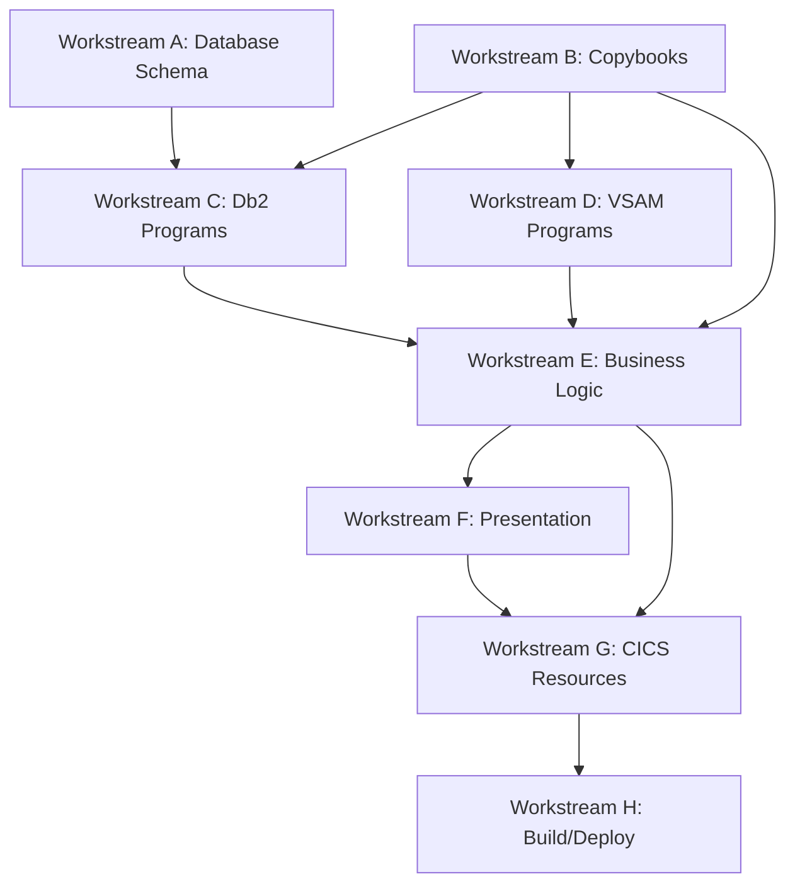

# Implementation Plan: Electric Vehicle Policy Type

**Created**: 2026-06-05T03:10:56Z
**Author**: IBM Bob Premium Package for Z AI Assistant
**Analysis Method**: Local Workspace
**Workspace Alignment**: Fully Aligned
**Data Dictionary Coverage**: Partial

---

## 1. Executive Summary

**Change Description**: Add electric vehicle insurance as a new policy type to the GenApp insurance application, following the established pattern of Endowment (E), House (H), Motor (M), and Commercial (C) policies. The new policy type will use request ID '01AELC' and policy type indicator 'L' (for eLectric), with a dedicated ELECTRIC database table.

**Business Value**: Expands the insurance product portfolio to support the growing electric vehicle market, enabling the company to offer specialized coverage for electric vehicles with unique attributes such as battery capacity, charging infrastructure, and electric-specific features.

**Key Risks**: 
- Database schema changes require careful coordination with existing two-phase commit logic
- COMMAREA structure modifications must maintain backward compatibility
- VSAM file key structure changes affect all policy operations
- New transaction and BMS map definitions require CICS resource updates

**Workspace Notes**: All required source files are available in the local workspace. The implementation follows the well-established pattern used for Motor, Endowment, House, and Commercial policies.

**Prerequisites**: None - all necessary programs and copybooks are present in the workspace.

---

## 2. Prerequisites

No prerequisites required. All source files and dependencies are available in the workspace.

---

## 3. Requirements

### Functional Requirements

- **FR1**: Support creation of electric vehicle insurance policies with request ID '01AELC'
- **FR2**: Store electric vehicle-specific attributes (battery capacity, range, charging type, make, model, value)
- **FR3**: Maintain separate ELECTRIC database table following existing pattern (ENDOWMENT, HOUSE, MOTOR, COMMERCIAL)
- **FR4**: Support full CRUD operations (Add, Inquire, Update, Delete) for electric vehicle policies
- **FR5**: Integrate with existing two-phase commit pattern (Db2 + VSAM)
- **FR6**: Use policy type indicator 'L' in VSAM key structure and database
- **FR7**: Provide 3270 menu interface via new transaction SSP5

### Non-Functional Requirements

- **NFR1**: Maintain backward compatibility with existing policy types and COMMAREA structure
- **NFR2**: Follow existing three-tier architecture (presentation → business logic → data access)
- **NFR3**: Preserve existing error handling patterns (CA-RETURN-CODE, LGSTSQ logging)
- **NFR4**: Support same security and audit mechanisms as other policy types
- **NFR5**: Maintain performance characteristics consistent with existing policy operations

### Business Requirements

- **BR1**: Enable insurance agents to quote and issue electric vehicle policies
- **BR2**: Support electric vehicle-specific underwriting criteria
- **BR3**: Provide reporting and analytics for electric vehicle policy portfolio

---

## 4. Goals and Non-Goals

### Goals

What MUST be implemented:

1. Create complete program family for electric vehicle policies (LGAELC01, LGIELC01, LGUELC01, LGDELC01 and their DB/VS variants)
2. Add ELECTRIC table to Db2 database with appropriate schema
3. Extend COMMAREA copybook (lgcmarea.cpy) with CA-ELECTRIC structure
4. Extend policy copybook (lgpolicy.cpy) with DB2-ELECTRIC structure
5. Create new transaction SSP5 and presentation program LGTESTP5
6. Update BMS map (ssmap.bms) to support electric vehicle menu
7. Provide JCL for compilation, Db2 binding, and CICS resource definitions
8. Update VSAM file structure to accommodate 'L' policy type indicator

### Non-Goals

What is OUT OF SCOPE:

1. No changes to customer management programs (LGACUS01, LGICUS01, LGUCUS01)
2. No modifications to existing policy types (Motor, Endowment, House, Commercial)
3. No changes to named counter service or temporary storage queue logic
4. No web services implementation (can be added later following existing pattern)
5. No changes to Workload Simulator scripts (can be added later)
6. No integration with external electric vehicle data providers

---

## 5. Current State Analysis

### System Context

**Programs Analyzed**: 12 policy-related programs across 4 policy types

**Key Programs**:

- `LGAPOL01`: Add policy business logic [Workspace: Available]
- `LGAPDB01`: Add policy to Db2 database [Workspace: Available]
- `LGAPVS01`: Add policy to VSAM file [Workspace: Available]
- `LGIPOL01`: Inquire policy business logic [Workspace: Available]
- `LGIPDB01`: Inquire policy from Db2 database [Workspace: Available]
- `LGIPVS01`: Inquire policy from VSAM file [Workspace: Available]
- `LGUPOL01`: Update policy business logic [Workspace: Available]
- `LGUPDB01`: Update policy in Db2 database [Workspace: Available]
- `LGUPVS01`: Update policy in VSAM file [Workspace: Available]
- `LGDPOL01`: Delete policy business logic [Workspace: Available]
- `LGDPDB01`: Delete policy from Db2 database [Workspace: Available]
- `LGDPVS01`: Delete policy from VSAM file [Workspace: Available]

**Database Tables**:

- `POLICY`: Master policy table (contains policy type indicator)
- `ENDOWMENT`: Endowment-specific policy details
- `HOUSE`: House-specific policy details
- `MOTOR`: Motor-specific policy details
- `COMMERCIAL`: Commercial-specific policy details
- `ELECTRIC`: **NEW** - Electric vehicle-specific policy details

**VSAM Files**:

- `KSDSPOLY`: Policy records with composite key (PolicyType + CustomerNum + PolicyNum)

**Presentation Programs**:

- `LGTESTP1`: Motor policy menu (SSP1 transaction)
- `LGTESTP2`: Endowment policy menu (SSP2 transaction)
- `LGTESTP3`: House policy menu (SSP3 transaction)
- `LGTESTP4`: Commercial policy menu (SSP4 transaction)
- `LGTESTP5`: **NEW** - Electric vehicle policy menu (SSP5 transaction)

### Key Findings

**Architecture Pattern Identified**:
The application uses a consistent three-tier architecture for all policy types:
1. **Presentation Layer**: LGTESTP[1-4] programs handle 3270 UI and input validation
2. **Business Logic Layer**: LG[A|I|U|D]POL01 programs orchestrate operations
3. **Data Access Layer**: LG[A|I|U|D]PDB01 (Db2) and LG[A|I|U|D]PVS01 (VSAM) programs

**Request ID Pattern**:
- Motor: '01AMOT' (Add), '01IMOT' (Inquire), '01UMOT' (Update), '01DMOT' (Delete)
- Endowment: '01AEND', '01IEND', '01UEND', '01DEND'
- House: '01AHOU', '01IHOU', '01UHOU', '01DHOU'
- Commercial: '01ACOM', '01ICOM', '01UCOM', '01DCOM'
- **Electric**: '01AELC', '01IELC', '01UELC', '01DELC' (NEW)

**Policy Type Indicators**:
- M = Motor
- E = Endowment
- H = House
- C = Commercial
- **L = eLectric** (NEW)

**Two-Phase Commit Pattern**:
All policy operations use coordinated Db2 and VSAM updates with rollback capability, as documented in Architecture.md. This pattern must be preserved for electric vehicle policies.

### Assumptions

- Electric vehicle policies follow the same lifecycle as motor policies (issue, update, delete)
- Policy numbering uses existing Db2 identity column generation
- Electric vehicle-specific attributes include: battery capacity (kWh), range (miles), charging type, make, model, value, registration number
- COMMAREA structure has sufficient space in CA-POLICY-SPECIFIC (32400 bytes) for electric vehicle data
- VSAM file key structure supports 'L' as a valid policy type indicator
- Existing BMS map can be extended with new menu option for electric vehicles

### Constraints

- **Backward Compatibility**: COMMAREA changes must not break existing programs that pass oversized lengths
- **VSAM Key Structure**: Policy type indicator must be single character to maintain 21-character key format
- **Db2 Referential Integrity**: ELECTRIC table must reference POLICY table via foreign key
- **Two-Phase Commit**: Must maintain existing commit coordination between Db2 and VSAM
- **CICS Resource Naming**: New resources must follow existing naming conventions (LGAELC*, LGIELC*, etc.)
- **JCL Compatibility**: Compilation and binding jobs must work with existing MVS environment
- **Transaction IDs**: Must use SSP5 to follow existing SSP[1-4] pattern

---

## 6. Implementation Design

### Workstreams

#### Workstream A: Database Schema Changes

**Purpose**: Create ELECTRIC table in Db2 and update POLICY table constraints

**Tasks**:

1. Create ELECTRIC table with columns for electric vehicle attributes
2. Update POLICY table to allow 'L' as valid policy type
3. Create indexes for performance optimization
4. Grant appropriate permissions to CICS connection ID
5. Create Db2 bind package for new programs

**Dependencies**: Must complete before Workstream C (Data Access Programs)

#### Workstream B: COMMAREA and Copybook Extensions

**Purpose**: Extend shared data structures to support electric vehicle attributes

**Tasks**:

1. Update lgcmarea.cpy with CA-ELECTRIC structure
2. Update lgpolicy.cpy with DB2-ELECTRIC structure and length constants
3. Ensure backward compatibility via REDEFINES

**Dependencies**: Must complete before all program workstreams

#### Workstream C: Data Access Programs (Db2)

**Purpose**: Create programs for Db2 database operations on ELECTRIC table

**Tasks**:

1. Create LGAELDB01 (Add Electric to Db2)
2. Create LGIELDB01 (Inquire Electric from Db2)
3. Create LGUELDB01 (Update Electric in Db2)
4. Create LGDELDB01 (Delete Electric from Db2)

**Dependencies**: Requires Workstream A (Database) and Workstream B (Copybooks)

#### Workstream D: Data Access Programs (VSAM)

**Purpose**: Create programs for VSAM file operations on KSDSPOLY

**Tasks**:

1. Create LGAELVS01 (Add Electric to VSAM)
2. Create LGIELVS01 (Inquire Electric from VSAM)
3. Create LGUELVS01 (Update Electric in VSAM)
4. Create LGDELVS01 (Delete Electric from VSAM)

**Dependencies**: Requires Workstream B (Copybooks)

#### Workstream E: Business Logic Programs

**Purpose**: Create orchestration layer for electric vehicle policy operations

**Tasks**:

1. Create LGAELC01 (Add Electric Business Logic)
2. Create LGIELC01 (Inquire Electric Business Logic)
3. Create LGUELC01 (Update Electric Business Logic)
4. Create LGDELC01 (Delete Electric Business Logic)

**Dependencies**: Requires Workstream C (Db2 programs) and Workstream D (VSAM programs)

#### Workstream F: Presentation Layer

**Purpose**: Create 3270 user interface for electric vehicle policies

**Tasks**:

1. Create LGTESTP5 (Electric Vehicle Menu)
2. Update ssmap.bms with new map definition for SSP5

**Dependencies**: Requires Workstream E (Business Logic programs)

#### Workstream G: CICS Resource Definitions

**Purpose**: Define CICS resources for electric vehicle policy support

**Tasks**:

1. Create transaction definition for SSP5
2. Create program definitions for all new programs
3. Define mapset for electric vehicle BMS map

**Dependencies**: Requires all program workstreams to be complete

#### Workstream H: Build and Deployment Artifacts

**Purpose**: Create JCL and scripts for compilation and deployment

**Tasks**:

1. Update compilation JCL to include new programs
2. Create Db2 bind entries for new programs
3. Update CICS resource definition JCL
4. Update cust1.rexx customization script
5. Create installation documentation

**Dependencies**: Requires all other workstreams

### Execution Sequence



**Critical Path**:

1. Workstream B: Copybook Extensions (foundational for all programs)
2. Workstream A: Database Schema (required for Db2 programs)
3. Workstream C: Db2 Data Access Programs
4. Workstream D: VSAM Data Access Programs
5. Workstream E: Business Logic Programs
6. Workstream F: Presentation Layer
7. Workstream G: CICS Resource Definitions
8. Workstream H: Build and Deployment

**Parallel Work Opportunities**:

- Workstream C (Db2 programs) and Workstream D (VSAM programs) can be developed in parallel after Workstream B completes
- Workstream G (CICS resources) can be drafted in parallel with program development
- Workstream H (Build artifacts) can be prepared in parallel with later workstreams

---

## 7. Affected Components

### Programs

| Program Name | Change Type | Reason | Workspace Status |
|--------------|-------------|--------|------------------|
| LGAELC01 | Add | New business logic for adding electric vehicle policies | N/A (New) |
| LGAELDB01 | Add | New Db2 data access for adding electric vehicle records | N/A (New) |
| LGAELVS01 | Add | New VSAM data access for adding electric vehicle records | N/A (New) |
| LGIELC01 | Add | New business logic for inquiring electric vehicle policies | N/A (New) |
| LGIELDB01 | Add | New Db2 data access for inquiring electric vehicle records | N/A (New) |
| LGIELVS01 | Add | New VSAM data access for inquiring electric vehicle records | N/A (New) |
| LGUELC01 | Add | New business logic for updating electric vehicle policies | N/A (New) |
| LGUELDB01 | Add | New Db2 data access for updating electric vehicle records | N/A (New) |
| LGUELVS01 | Add | New VSAM data access for updating electric vehicle records | N/A (New) |
| LGDELC01 | Add | New business logic for deleting electric vehicle policies | N/A (New) |
| LGDELDB01 | Add | New Db2 data access for deleting electric vehicle records | N/A (New) |
| LGDELVS01 | Add | New VSAM data access for deleting electric vehicle records | N/A (New) |
| LGTESTP5 | Add | New presentation logic for electric vehicle policy menu | N/A (New) |

### Database Tables/Files

| Table/File Name | Change Type | Reason |
|-----------------|-------------|--------|
| ELECTRIC | Add | New Db2 table to store electric vehicle-specific policy attributes |
| POLICY | Modify | Update constraints to allow 'L' as valid policy type indicator |
| KSDSPOLY | Modify | VSAM file will store electric vehicle records with 'L' key prefix |

### Copybooks/Includes

| Copybook Name | Change Type | Reason | Workspace Status |
|---------------|-------------|--------|------------------|
| lgcmarea.cpy | Modify | Add CA-ELECTRIC structure in CA-POLICY-SPECIFIC redefines | Available |
| lgpolicy.cpy | Modify | Add DB2-ELECTRIC structure and WS-ELECTRIC-LEN constants | Available |

### CICS Resources

| Resource Name | Resource Type | Change Type | Reason |
|---------------|---------------|-------------|--------|
| SSP5 | TRANSACTION | Add | New transaction for electric vehicle policy menu |
| LGAELC01-LGDELVS01 | PROGRAM | Add | New program definitions (13 programs total) |
| LGTESTP5 | PROGRAM | Add | New program definition |

---

## 8. Data Model Changes

### Database Schema Changes

#### New Table: ELECTRIC

**DDL**:

```sql
CREATE TABLE ELECTRIC (
    POLICYNUMBER    INTEGER NOT NULL,
    CUSTOMERNUMBER  INTEGER NOT NULL,
    MAKE            VARCHAR(15),
    MODEL           VARCHAR(15),
    VALUE           INTEGER,
    REGNUMBER       VARCHAR(7),
    BATTERY_CAPACITY INTEGER,
    RANGE           INTEGER,
    CHARGING_TYPE   VARCHAR(20),
    COLOUR          VARCHAR(8),
    MANUFACTURED    DATE,
    PREMIUM         INTEGER,
    PRIMARY KEY (POLICYNUMBER),
    FOREIGN KEY (POLICYNUMBER) 
        REFERENCES POLICY(POLICYNUMBER) 
        ON DELETE CASCADE
);
```

**Backward Compatibility**: Yes (additive change)

#### Modified Table: POLICY

**Changes**: Update CHECK constraint to allow 'L' as valid POLICYTYPE value

**Backward Compatibility**: Yes (additive change)

---

## 9. Risks and Mitigations

| Risk | Likelihood | Impact | Mitigation |
|------|------------|--------|------------|
| COMMAREA size miscalculation breaks existing programs | Low | High | Validate total COMMAREA size remains 32500 bytes |
| Two-phase commit coordination failure | Medium | High | Follow existing pattern exactly; implement comprehensive error handling |
| Db2 referential integrity violation | Low | Medium | Ensure POLICY record created before ELECTRIC record |
| CICS resource definition conflicts | Low | Medium | Follow naming conventions; verify no conflicts |

---

## 10. Testing Strategy

### Unit Tests

**Coverage Target**: 90% of new code paths

**Key Test Cases**: Add, Inquire, Update, Delete operations for all program layers

### Integration Tests

**Scope**: Test interaction between presentation, business logic, and data access layers

### End-to-End Tests

**Scenarios**: Complete electric vehicle policy lifecycle from creation to deletion

### Regression Tests

**Existing Functionality to Validate**: All existing policy types (Motor, Endowment, House, Commercial) continue to work

---

## 11. Rollout and Operational Plan

### Monitoring

**Key Metrics**: Transaction volume, error rate, response time, Db2 performance, VSAM performance

### Rollback Plan

**Trigger Conditions**: Critical errors, data corruption, performance degradation

**Rollback Steps**: Disable SSP5 transaction, remove CICS resources, restore previous copybooks

---

## Appendix A: Analysis Data

### Programs Analyzed

40 programs across 4 existing policy types (Motor, Endowment, House, Commercial)

### Key Variables/Data Structures

COMMAREA structure, Policy copybook structure, VSAM key structure

### Control Flow Insights

Three-tier architecture pattern, request routing pattern, error handling pattern

---

**Last Updated**: 2026-06-05T03:10:56Z
**Next Review Date**: After implementation completion