# CICS GenApp Architecture Diagram

This document contains the comprehensive architecture diagram for the CICS General Insurance Application, showing the main components and their interactions.

## System Architecture

```mermaid
graph TB
    subgraph "Presentation Layer - 3270 Terminal Interface"
        T1[3270 Terminal]
        BMS[BMS Maps - SSMAP]
        LGSE[LGSE - Setup Transaction]
        SSC1[SSC1 - Customer Menu]
        SSP1[SSP1 - Motor Policy]
        SSP2[SSP2 - Endowment Policy]
        SSP3[SSP3 - House Policy]
        SSP4[SSP4 - Commercial Policy]
        
        LGTESTC1[LGTESTC1<br/>Customer Presentation]
        LGTESTP1[LGTESTP1<br/>Motor Presentation]
        LGTESTP2[LGTESTP2<br/>Endowment Presentation]
        LGTESTP3[LGTESTP3<br/>House Presentation]
        LGTESTP4[LGTESTP4<br/>Commercial Presentation]
    end

    subgraph "Business Logic Layer"
        LGACUS01[LGACUS01<br/>Add Customer Logic]
        LGICUS01[LGICUS01<br/>Inquire Customer Logic]
        LGUCUS01[LGUCUS01<br/>Update Customer Logic]
        
        LGAPOL01[LGAPOL01<br/>Add Policy Logic]
        LGIPOL01[LGIPOL01<br/>Inquire Policy Logic]
        LGUPOL01[LGUPOL01<br/>Update Policy Logic]
        LGDPOL01[LGDPOL01<br/>Delete Policy Logic]
    end

    subgraph "Data Access Layer"
        subgraph "Customer Data Access"
            LGACDB01[LGACDB01<br/>Add Customer DB2]
            LGICDB01[LGICDB01<br/>Inquire Customer DB2]
            LGUCDB01[LGUCDB01<br/>Update Customer DB2]
            
            LGACVS01[LGACVS01<br/>Add Customer VSAM]
            LGICVS01[LGICVS01<br/>Inquire Customer VSAM]
            LGUCVS01[LGUCVS01<br/>Update Customer VSAM]
        end
        
        subgraph "Policy Data Access"
            LGAPDB01[LGAPDB01<br/>Add Policy DB2]
            LGIPDB01[LGIPDB01<br/>Inquire Policy DB2]
            LGUPDB01[LGUPDB01<br/>Update Policy DB2]
            LGDPDB01[LGDPDB01<br/>Delete Policy DB2]
            
            LGAPVS01[LGAPVS01<br/>Add Policy VSAM]
            LGIPVS01[LGIPVS01<br/>Inquire Policy VSAM]
            LGUPVS01[LGUPVS01<br/>Update Policy VSAM]
            LGDPVS01[LGDPVS01<br/>Delete Policy VSAM]
        end
    end

    subgraph "Persistence Layer"
        DB2[(DB2 Database<br/>-----------<br/>Customer Table<br/>Policy Table<br/>Motor Policy Table<br/>Endowment Policy Table<br/>House Policy Table<br/>Commercial Policy Table)]
        
        VSAM[(VSAM Files<br/>-----------<br/>KSDSCUST<br/>Customer Records<br/><br/>KSDSPOLY<br/>Policy Records)]
    end

    subgraph "Supporting Services"
        NCS[Named Counter Server<br/>Coupling Facility<br/>Customer Number Generation]
        TSQ[Temporary Storage Queues<br/>-----------<br/>GENACNTL - Control<br/>GENAERRS - Errors]
        LGSETUP[LGSETUP<br/>Initialize Counters & TSQ]
        LGSTSQ[LGSTSQ<br/>Write to TSQ]
        LGASTAT1[LGASTAT1<br/>Update Transaction Counts]
        LGWEBST5[LGWEBST5<br/>Copy Counts to TSQ]
    end

    subgraph "CICS Region"
        CICS[CICS Transaction Server<br/>-----------<br/>Transaction Management<br/>Resource Definitions<br/>DB2 Attachment Facility]
    end

    %% Presentation to Business Logic Links
    T1 -->|BMS Maps| BMS
    BMS --> SSC1 & SSP1 & SSP2 & SSP3 & SSP4 & LGSE
    SSC1 --> LGTESTC1
    SSP1 --> LGTESTP1
    SSP2 --> LGTESTP2
    SSP3 --> LGTESTP3
    SSP4 --> LGTESTP4
    LGSE --> LGSETUP
    
    LGTESTC1 -->|EXEC CICS LINK<br/>COMMAREA| LGACUS01 & LGICUS01 & LGUCUS01
    LGTESTP1 & LGTESTP2 & LGTESTP3 & LGTESTP4 -->|EXEC CICS LINK<br/>COMMAREA| LGAPOL01 & LGIPOL01 & LGUPOL01 & LGDPOL01

    %% Business Logic to Data Access Links
    LGACUS01 -->|EXEC CICS LINK| LGACDB01 & LGACVS01
    LGICUS01 -->|EXEC CICS LINK| LGICDB01 & LGICVS01
    LGUCUS01 -->|EXEC CICS LINK| LGUCDB01 & LGUCVS01
    
    LGAPOL01 -->|EXEC CICS LINK| LGAPDB01 & LGAPVS01
    LGIPOL01 -->|EXEC CICS LINK| LGIPDB01 & LGIPVS01
    LGUPOL01 -->|EXEC CICS LINK| LGUPDB01 & LGUPVS01
    LGDPOL01 -->|EXEC CICS LINK| LGDPDB01 & LGDPVS01

    %% Data Access to Persistence Links
    LGACDB01 & LGICDB01 & LGUCDB01 & LGAPDB01 & LGIPDB01 & LGUPDB01 & LGDPDB01 -->|SQL Operations| DB2
    LGACVS01 & LGICVS01 & LGUCVS01 & LGAPVS01 & LGIPVS01 & LGUPVS01 & LGDPVS01 -->|READ/WRITE| VSAM

    %% Supporting Services Links
    LGACUS01 -->|GET COUNTER| NCS
    LGACUS01 & LGAPOL01 -->|Write Errors| LGSTSQ
    LGSTSQ --> TSQ
    LGASTAT1 --> NCS
    LGWEBST5 --> NCS
    LGWEBST5 --> TSQ
    LGSETUP --> NCS & TSQ

    %% Two-Phase Commit
    LGACDB01 & LGAPDB01 -.->|Two-Phase Commit<br/>Coordinator| CICS
    LGACVS01 & LGAPVS01 -.->|Two-Phase Commit<br/>Participant| CICS
    CICS -.->|Manages| DB2 & VSAM

    %% CICS manages all transactions
    CICS -.->|Manages| LGTESTC1 & LGTESTP1 & LGTESTP2 & LGTESTP3 & LGTESTP4
    CICS -.->|DB2 Attachment| DB2

    style T1 fill:#e1f5ff
    style DB2 fill:#fff4e1
    style VSAM fill:#fff4e1
    style NCS fill:#f0f0f0
    style TSQ fill:#f0f0f0
    style CICS fill:#ffe1e1
```

## Architecture Overview

### Presentation Layer (3270 Terminal Interface)

The presentation layer provides the user interface through 3270 terminal emulation:

- **Transactions**: 5 main transactions for different business functions
  - `SSC1` - Customer menu (inquire, add customer records)
  - `SSP1` - Motor insurance policy operations
  - `SSP2` - Endowment insurance policy operations
  - `SSP3` - House insurance policy operations
  - `SSP4` - Commercial property insurance policy operations
  - `LGSE` - Setup transaction for initialization

- **BMS Maps**: [`SSMAP`](../base/src/ssmap.bms) controls screen layout for 3270 interface

- **Presentation Programs**: Handle user interaction and input validation
  - [`LGTESTC1`](../base/src/lgtestc1.cbl) - Customer presentation logic
  - [`LGTESTP1`](../base/src/lgtestp1.cbl) - Motor policy presentation
  - [`LGTESTP2`](../base/src/lgtestp2.cbl) - Endowment policy presentation
  - [`LGTESTP3`](../base/src/lgtestp3.cbl) - House policy presentation
  - [`LGTESTP4`](../base/src/lgtestp4.cbl) - Commercial property presentation

### Business Logic Layer

The business logic layer orchestrates operations between presentation and data access:

**Customer Operations:**
- [`LGACUS01`](../base/src/lgacus01.cbl) - Add customer business logic
- [`LGICUS01`](../base/src/lgicus01.cbl) - Inquire customer business logic
- [`LGUCUS01`](../base/src/lgucus01.cbl) - Update customer business logic

**Policy Operations:**
- [`LGAPOL01`](../base/src/lgapol01.cbl) - Add policy business logic
- [`LGIPOL01`](../base/src/lgipol01.cbl) - Inquire policy business logic
- [`LGUPOL01`](../base/src/lgupol01.cbl) - Update policy business logic
- [`LGDPOL01`](../base/src/lgdpol01.cbl) - Delete policy business logic

**Communication Contract:**
- [`lgcmarea.cpy`](../base/src/lgcmarea.cpy) - COMMAREA copybook provides stable interface between layers
- Request routing driven by `CA-REQUEST-ID` field
- Return codes communicated via `CA-RETURN-CODE` field

### Data Access Layer

The data access layer manages persistence operations with dual storage:

**Customer Data Access:**
- **DB2 Programs**: [`LGACDB01`](../base/src/lgacdb01.cbl), [`LGICDB01`](../base/src/lgicdb01.cbl), [`LGUCDB01`](../base/src/lgucdb01.cbl)
- **VSAM Programs**: [`LGACVS01`](../base/src/lgacvs01.cbl), [`LGICVS01`](../base/src/lgicvs01.cbl), [`LGUCVS01`](../base/src/lgucvs01.cbl)

**Policy Data Access:**
- **DB2 Programs**: [`LGAPDB01`](../base/src/lgapdb01.cbl), [`LGIPDB01`](../base/src/lgipdb01.cbl), [`LGUPDB01`](../base/src/lgupdb01.cbl), [`LGDPDB01`](../base/src/lgdpdb01.cbl)
- **VSAM Programs**: [`LGAPVS01`](../base/src/lgapvs01.cbl), [`LGIPVS01`](../base/src/lgipvs01.cbl), [`LGUPVS01`](../base/src/lgupvs01.cbl), [`LGDPVS01`](../base/src/lgdpvs01.cbl)

### Persistence Layer

**DB2 Database:**
- Customer table - stores customer records with unique customer numbers
- Policy table - stores policy records with referential integrity to customers
- Motor policy table - motor insurance specific details
- Endowment policy table - endowment insurance specific details
- House policy table - house insurance specific details
- Commercial policy table - commercial property insurance specific details

**VSAM Files:**
- `KSDSCUST` - Customer records (key: first 10 characters)
- `KSDSPOLY` - Policy records (key: first 21 characters)
  - Format: `[Type][Customer ID][Policy Number][Details]`
  - Types: C=Commercial, E=Endowment, H=House, M=Motor

### Supporting Services

**Named Counter Server (Coupling Facility):**
- Generates unique customer numbers across all CICS regions
- Provides sequence numbers for applications in Parallel Sysplex
- Accessed via `EXEC CICS GET COUNTER` API

**Temporary Storage Queues:**
- `GENACNTL` - Control queue tracking customer number ranges
- `GENAERRS` - Error queue for DB2 operation failures

**Infrastructure Programs:**
- [`LGSETUP`](../base/src/lgsetup.cbl) - Initialize counters and temporary storage queues
- [`LGSTSQ`](../base/src/lgstsq.cbl) - Write messages to temporary storage queues
- [`LGASTAT1`](../base/src/lgastat1.cbl) - Update transaction counts using named counters
- [`LGWEBST5`](../base/src/lgwebst5.cbl) - Copy business transaction counts to TSQ

### CICS Region

The CICS Transaction Server manages:
- Transaction execution and lifecycle
- Resource definitions (FILES, TRANSACTIONS, PROGRAMS)
- DB2 attachment facility for database connectivity
- Two-phase commit coordination between DB2 and VSAM
- Coupling facility integration for named counters and TSQ

## Key Design Patterns

### Three-Tier Architecture
The application follows a strict three-tier design:
1. **Presentation** - User interface and input validation
2. **Business Logic** - Business rules and orchestration
3. **Data Access** - Persistence operations

### Inter-Program Communication
- Programs communicate using `EXEC CICS LINK PROGRAM` API
- COMMAREA structure provides parameter passing between layers
- Consistent interface contract across all program interactions

### Two-Phase Commit
- Ensures transactional integrity across DB2 and VSAM
- DB2 operations committed first (coordinator)
- VSAM operations follow (participant)
- CICS manages commit/rollback coordination
- Intentionally demonstrates two-phase commit for educational purposes

### Error Handling
- CICS-style error handling (not exception-based)
- Programs set `CA-RETURN-CODE` for status communication
- Error diagnostics written to temporary storage queues via [`LGSTSQ`](../base/src/lgstsq.cbl)
- Hard failures may trigger `ABEND` with diagnostic codes

## Data Flow Examples

### Add Customer Flow
1. User enters customer data in `SSC1` transaction
2. [`LGTESTC1`](../base/src/lgtestc1.cbl) validates input and normalizes data
3. Links to [`LGACUS01`](../base/src/lgacus01.cbl) with COMMAREA
4. [`LGACUS01`](../base/src/lgacus01.cbl) gets unique customer number from Named Counter Server
5. Links to [`LGACDB01`](../base/src/lgacdb01.cbl) to insert into DB2
6. Links to [`LGACVS01`](../base/src/lgacvs01.cbl) to write to VSAM
7. Two-phase commit ensures both updates succeed or both rollback
8. Returns success/failure to presentation layer

### Inquire Policy Flow
1. User requests policy inquiry in `SSP1-4` transaction
2. Presentation program links to [`LGIPOL01`](../base/src/lgipol01.cbl)
3. [`LGIPOL01`](../base/src/lgipol01.cbl) links to [`LGIPDB01`](../base/src/lgipdb01.cbl) for DB2 query
4. [`LGIPOL01`](../base/src/lgipol01.cbl) links to [`LGIPVS01`](../base/src/lgipvs01.cbl) for VSAM read
5. Data returned through COMMAREA to presentation layer
6. Presentation program displays results on 3270 screen

## Related Documentation

- [Architecture Overview](../base/Architecture.md) - Detailed architecture description
- [Reference Guide](../base/Reference.md) - Complete resource reference
- [Testing Guide](../base/Testing.md) - Transaction testing procedures
- [Building Guide](../base/Building.md) - Build and deployment process
- [Installation Guide](../base/Installation.md) - Installation instructions
- [AGENTS.md](../AGENTS.md) - Development guidelines and conventions

## Notes

- This architecture intentionally includes some non-best-practice constructs for demonstration purposes
- The dual DB2/VSAM persistence demonstrates two-phase commit processing
- Named counter server and temporary storage queues showcase coupling facility features
- The application is designed to scale across multiple CICS regions in a Parallel Sysplex