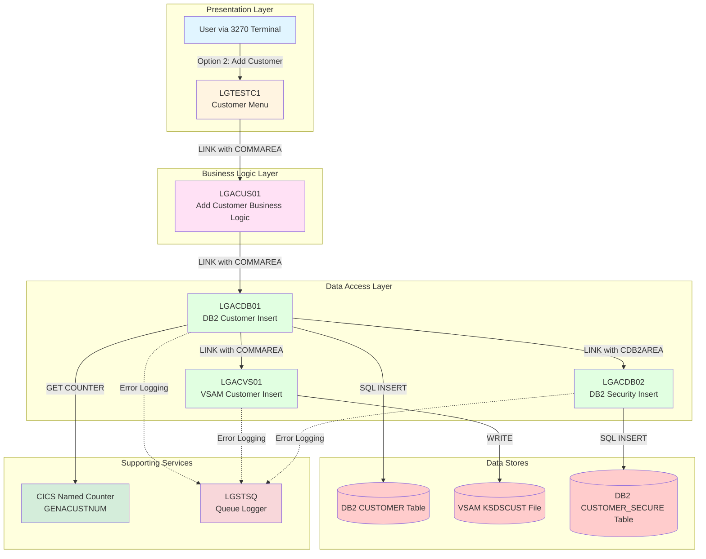
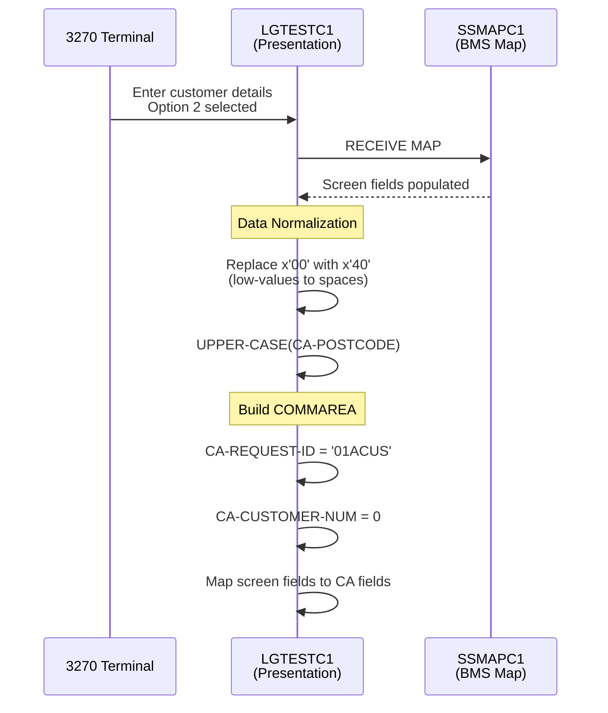
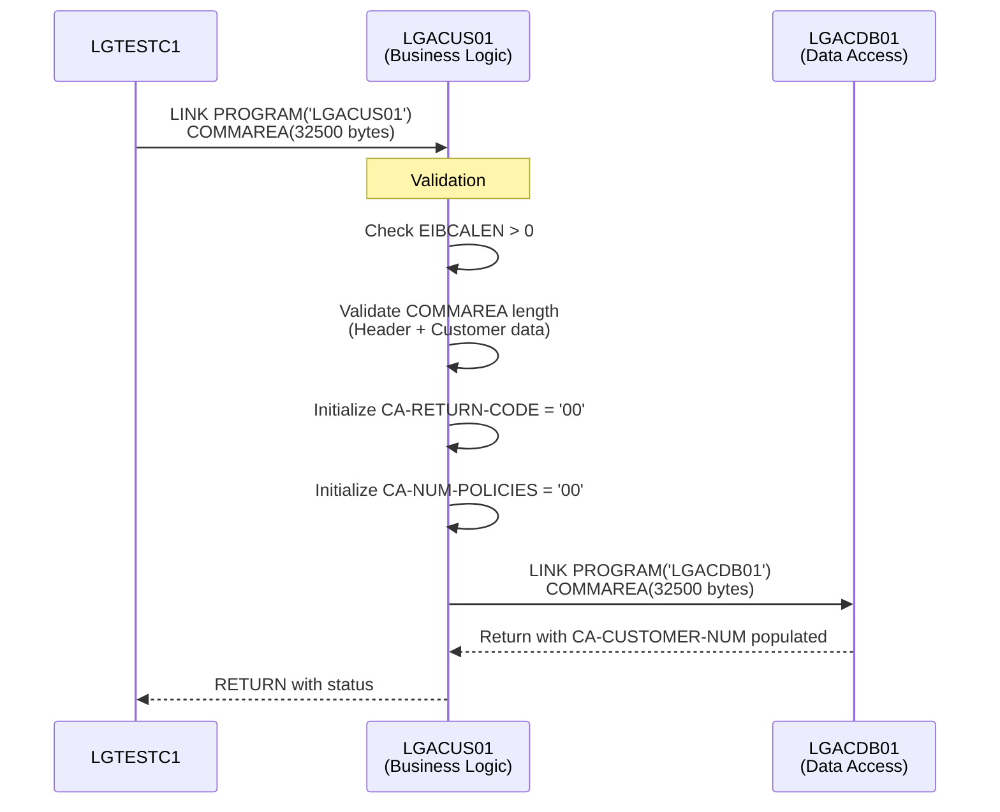
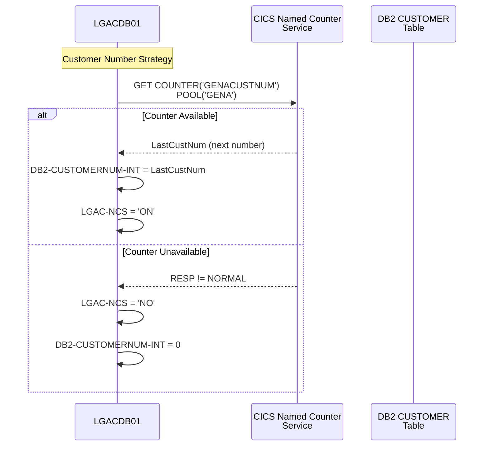
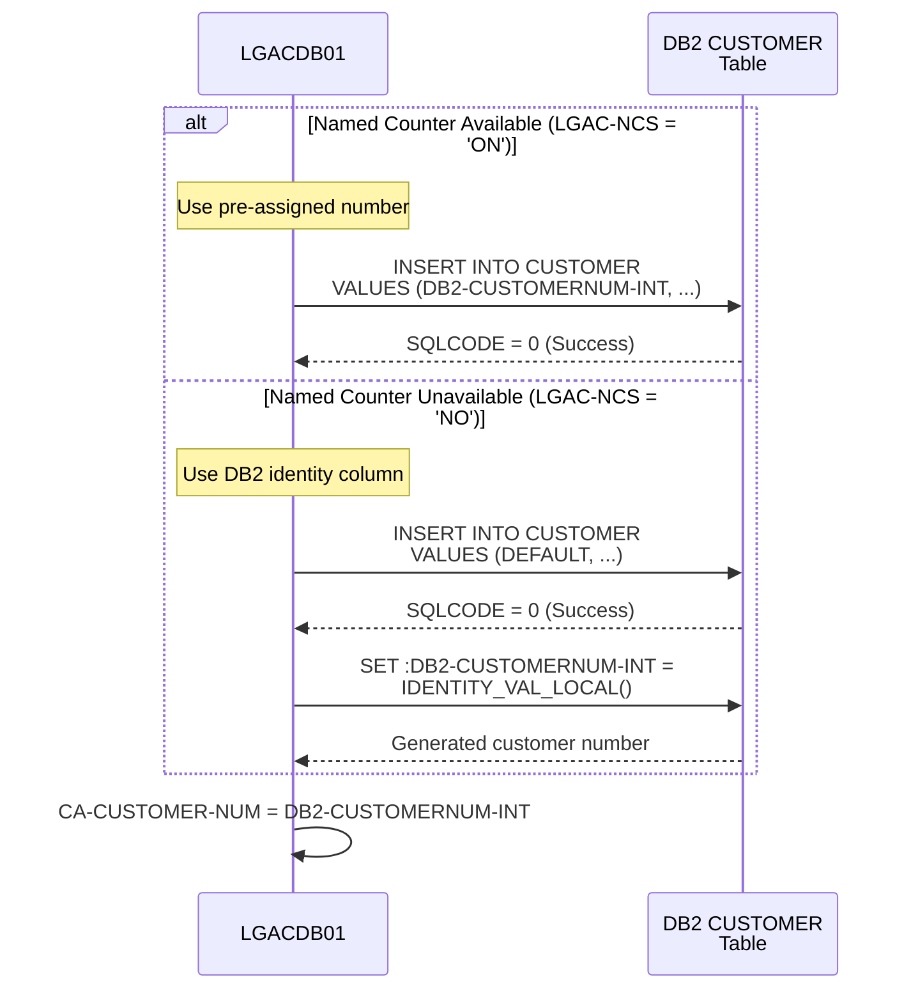
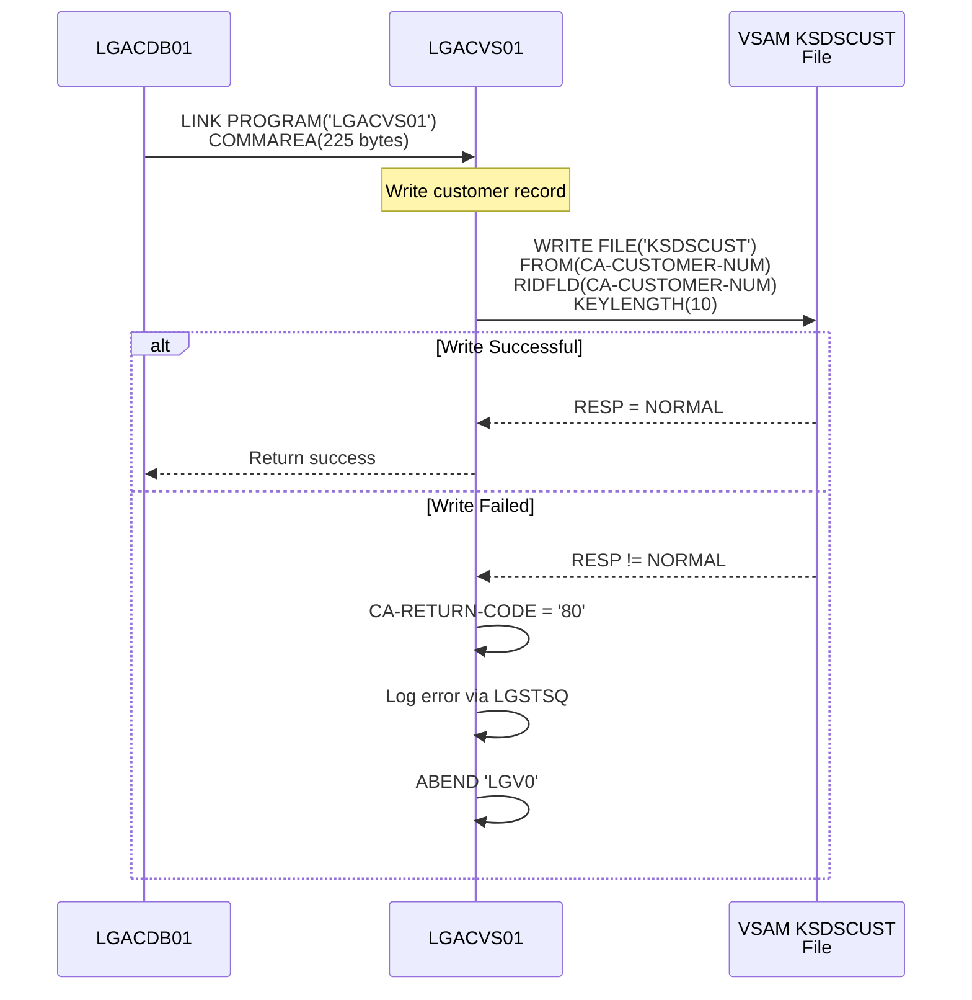
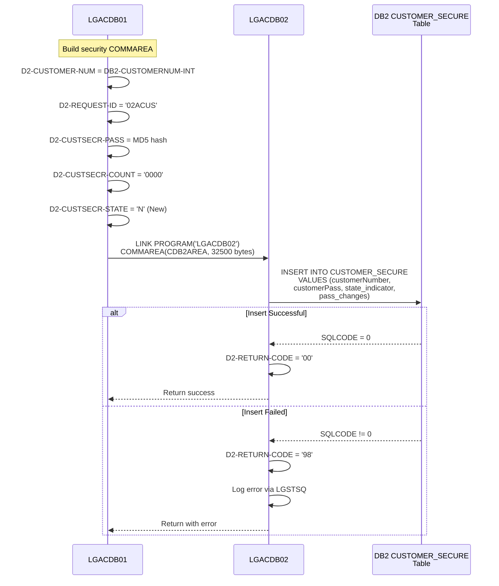
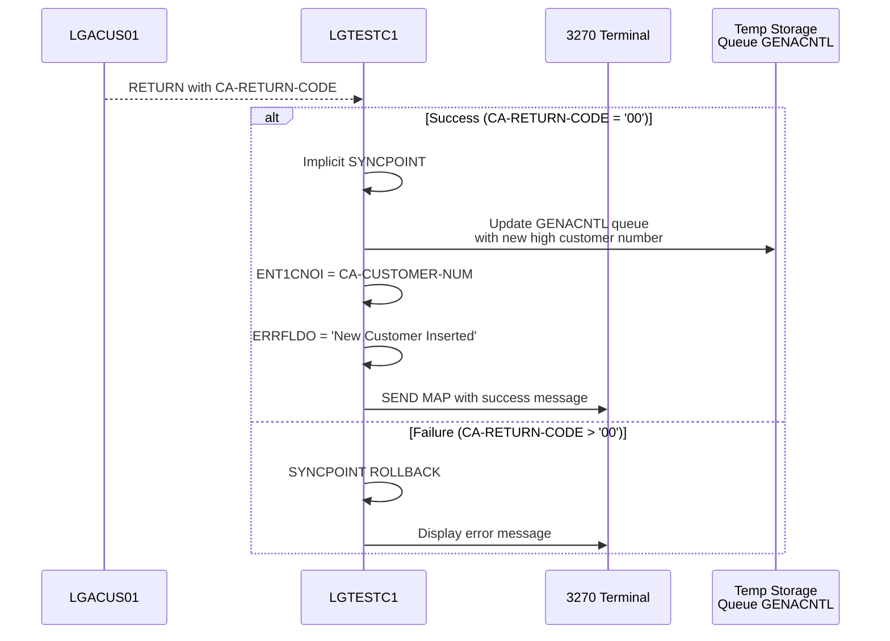
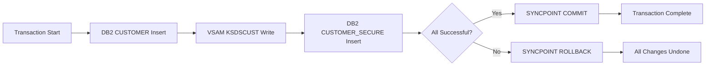
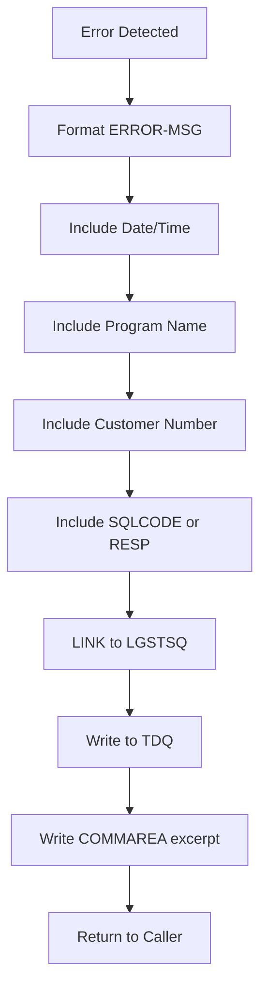

# Insert Customer Data Flow Diagram

## Overview
This document provides a comprehensive data flow diagram for the **Insert Customer** function in the GenApp CICS application. The insert customer operation follows a layered architecture pattern with presentation, business logic, and data access layers, demonstrating two-phase commit across both DB2 and VSAM data stores.

## High-Level Data Flow



## Detailed Data Flow with Field Mapping

### Phase 1: User Input Collection (LGTESTC1)



**Field Mapping (Screen → COMMAREA):**
| Screen Field | COMMAREA Field | Description |
|-------------|----------------|-------------|
| ENT1FNAI | CA-FIRST-NAME | Customer first name (10 chars) |
| ENT1LNAI | CA-LAST-NAME | Customer last name (20 chars) |
| ENT1DOBI | CA-DOB | Date of birth (10 chars) |
| ENT1HNMI | CA-HOUSE-NAME | House name (20 chars) |
| ENT1HNOI | CA-HOUSE-NUM | House number (4 chars) |
| ENT1HPCI | CA-POSTCODE | Postcode - uppercased (8 chars) |
| ENT1HP1I | CA-PHONE-HOME | Home phone (20 chars) |
| ENT1HP2I | CA-PHONE-MOBILE | Mobile phone (20 chars) |
| ENT1HMOI | CA-EMAIL-ADDRESS | Email address (100 chars) |

### Phase 2: Business Logic Processing (LGACUS01)



**COMMAREA Structure (LGCMAREA copybook):**
```
CA-REQUEST-ID (6)      = '01ACUS' (Add Customer request)
CA-RETURN-CODE (2)     = '00' (Success) or error code
CA-CUSTOMER-NUM (10)   = Generated customer number (output)
CA-CUSTOMER-REQUEST:
  - CA-FIRST-NAME (10)
  - CA-LAST-NAME (20)
  - CA-DOB (10)
  - CA-HOUSE-NAME (20)
  - CA-HOUSE-NUM (4)
  - CA-POSTCODE (8)
  - CA-NUM-POLICIES (3)
  - CA-PHONE-MOBILE (20)
  - CA-PHONE-HOME (20)
  - CA-EMAIL-ADDRESS (100)
```

### Phase 3: Customer Number Generation (LGACDB01)



### Phase 4: DB2 Customer Table Insert (LGACDB01)



**DB2 INSERT Statement Fields:**
| Host Variable | DB2 Column | Source | Description |
|--------------|------------|--------|-------------|
| :DB2-CUSTOMERNUM-INT | CUSTOMERNUMBER | Counter or DEFAULT | Unique customer ID |
| :CA-FIRST-NAME | FIRSTNAME | COMMAREA | Customer first name |
| :CA-LAST-NAME | LASTNAME | COMMAREA | Customer last name |
| :CA-DOB | DATEOFBIRTH | COMMAREA | Date of birth |
| :CA-HOUSE-NAME | HOUSENAME | COMMAREA | House name |
| :CA-HOUSE-NUM | HOUSENUMBER | COMMAREA | House number |
| :CA-POSTCODE | POSTCODE | COMMAREA | Postcode (uppercased) |
| :CA-PHONE-MOBILE | PHONEMOBILE | COMMAREA | Mobile phone |
| :CA-PHONE-HOME | PHONEHOME | COMMAREA | Home phone |
| :CA-EMAIL-ADDRESS | EMAILADDRESS | COMMAREA | Email address |

### Phase 5: VSAM Customer File Write (LGACVS01)



**VSAM Record Structure:**
- **Key Field**: CA-CUSTOMER-NUM (10 bytes)
- **Record Length**: 225 bytes
- **Data**: Complete customer information from COMMAREA

### Phase 6: Security Credentials Insert (LGACDB02)



**Security Insert Fields:**
| Field | Value | Description |
|-------|-------|-------------|
| customerNumber | DB2-CUSTOMERNUM-INT | Links to CUSTOMER table |
| customerPass | '5732fec825535eeafb8fac50fee3a8aa' | MD5 hash of default password |
| state_indicator | 'N' | New account state |
| pass_changes | 0 | Password change counter |

### Phase 7: Transaction Completion (LGTESTC1)



## Data Flow Summary Table

| Step | Component | Action | Input | Output | Error Handling |
|------|-----------|--------|-------|--------|----------------|
| 1 | LGTESTC1 | Collect input | Screen fields | COMMAREA with CA-REQUEST-ID='01ACUS' | Field validation |
| 2 | LGTESTC1 | Normalize data | Raw input | Uppercased postcode, spaces for nulls | N/A |
| 3 | LGACUS01 | Validate COMMAREA | COMMAREA | Validated structure | Return code '98' |
| 4 | LGACDB01 | Get customer number | Counter service | DB2-CUSTOMERNUM-INT | Fallback to DB2 identity |
| 5 | LGACDB01 | Insert customer | Customer data | DB2 CUSTOMER row | Return code '90', log error |
| 6 | LGACVS01 | Write VSAM | Customer data | VSAM KSDSCUST record | Return code '80', ABEND |
| 7 | LGACDB02 | Insert security | Security data | DB2 CUSTOMER_SECURE row | Return code '98', log error |
| 8 | LGTESTC1 | Update TSQ | New customer number | Updated GENACNTL queue | N/A |
| 9 | LGTESTC1 | Commit/Rollback | Transaction status | SYNCPOINT or ROLLBACK | Display error |

## Return Code Reference

| Return Code | Meaning | Set By | Action |
|-------------|---------|--------|--------|
| '00' | Success | All programs | Continue processing |
| '80' | VSAM write failure | LGACVS01 | ABEND 'LGV0' |
| '90' | DB2 customer insert failure | LGACDB01 | Log error, return |
| '98' | COMMAREA length error or security insert failure | LGACUS01, LGACDB01, LGACDB02 | Return to caller |
| '99' | Invalid request ID | LGACDB02 | Return to caller |

## Two-Phase Commit Behavior

The insert customer function demonstrates **two-phase commit** across multiple resource managers:



**Resource Managers Involved:**
1. **DB2** - CUSTOMER table
2. **VSAM** - KSDSCUST file
3. **DB2** - CUSTOMER_SECURE table
4. **TSQ** - GENACNTL temporary storage queue

**Commit Coordination:**
- CICS coordinates the two-phase commit protocol
- All resources must successfully complete before commit
- Any failure triggers rollback of all changes
- Error in LGACVS01 causes ABEND, forcing rollback
- Error in LGACDB01 or LGACDB02 returns error code, allowing LGTESTC1 to rollback

## Error Logging Flow

All data access programs use a common error logging pattern:



## Key Data Dictionary References

Based on the data dictionary ([`bobz/DD.json`](bobz/DD.json)), key variables in the insert customer flow:

- **DB2-CUSTOMERNUM-INT**: Host variable for unique customer identifier, used for DB2 inserts and retrieving auto-generated values
- **CA-FIRST-NAME** through **CA-EMAIL-ADDRESS**: Customer demographic data passed through COMMAREA
- **CA-RETURN-CODE**: Two-digit status code ('00'=success, '90'=SQL error, '98'=invalid length)
- **CA-CUSTOMER-NUM**: Newly assigned customer number returned after successful creation
- **LGAC-NCS**: Flag indicating Named Counter Service availability ('ON' or 'NO')
- **LastCustNum**: Most recent customer number from Named Counter Service
- **D2-CUSTSECR-PASS**: Initial security password hash for new account
- **D2-CUSTSECR-STATE**: Security state indicator ('N'=New)

## Architecture Notes

1. **Layered Design**: Clear separation between presentation (LGTESTC1), business logic (LGACUS01), and data access (LGACDB01, LGACVS01, LGACDB02)

2. **COMMAREA Contract**: Stable interface using LGCMAREA copybook, with CA-REQUEST-ID routing requests

3. **Data Normalization**: Presentation layer normalizes input (low-values to spaces, uppercase postcode) before passing to business logic

4. **Dual Persistence**: Customer data stored in both DB2 (relational) and VSAM (indexed) for demonstration purposes

5. **Customer Number Strategy**: Flexible approach using Named Counter Service when available, falling back to DB2 identity column

6. **Security Separation**: Customer credentials stored in separate CUSTOMER_SECURE table with MD5 password hash

7. **Error Handling**: CICS-style with return codes, error logging via LGSTSQ, and ABEND for critical failures

8. **Transaction Integrity**: Two-phase commit ensures consistency across DB2 and VSAM resources

## Related Documentation

- **Architecture**: [`base/Architecture.md`](base/Architecture.md) - Overall system architecture
- **Testing**: [`base/Testing.md`](base/Testing.md) - Transaction SSC1 for customer add testing
- **Reference**: [`base/Reference.md`](base/Reference.md) - Program reference details
- **Call Graph**: [`docs/callgraphs/LGACUS01-CALLGRAPH.md`](docs/callgraphs/LGACUS01-CALLGRAPH.md) - LGACUS01 program relationships

---

*Generated: 2026-06-15*  
*Mode: Z Architect*