# CICS GenApp System Architecture Diagram

**Display-Optimized Architecture Visualization**

This diagram is optimized for large monitor display and presentation purposes.

---

## System Architecture

```mermaid
graph TB
    subgraph "Presentation Layer - 3270 Terminal Interface"
        T1[3270 Terminal]
        BMS[BMS Maps - SSMAP]
        LGSE[LGSE - Setup Transaction]
        SSC1[SSC1 - Customer Menu]
        SSP1[SSP1 - Motor Policy]
        SSP2[SSP2 - Endowment Policy]
        SSP3[SSP3 - House Policy]
        SSP4[SSP4 - Commercial Policy]
        
        LGTESTC1[LGTESTC1<br/>Customer Presentation]
        LGTESTP1[LGTESTP1<br/>Motor Presentation]
        LGTESTP2[LGTESTP2<br/>Endowment Presentation]
        LGTESTP3[LGTESTP3<br/>House Presentation]
        LGTESTP4[LGTESTP4<br/>Commercial Presentation]
    end

    subgraph "Business Logic Layer"
        LGACUS01[LGACUS01<br/>Add Customer Logic]
        LGICUS01[LGICUS01<br/>Inquire Customer Logic]
        LGUCUS01[LGUCUS01<br/>Update Customer Logic]
        
        LGAPOL01[LGAPOL01<br/>Add Policy Logic]
        LGIPOL01[LGIPOL01<br/>Inquire Policy Logic]
        LGUPOL01[LGUPOL01<br/>Update Policy Logic]
        LGDPOL01[LGDPOL01<br/>Delete Policy Logic]
    end

    subgraph "Data Access Layer"
        subgraph "Customer Data Access"
            LGACDB01[LGACDB01<br/>Add Customer DB2]
            LGICDB01[LGICDB01<br/>Inquire Customer DB2]
            LGUCDB01[LGUCDB01<br/>Update Customer DB2]
            
            LGACVS01[LGACVS01<br/>Add Customer VSAM]
            LGICVS01[LGICVS01<br/>Inquire Customer VSAM]
            LGUCVS01[LGUCVS01<br/>Update Customer VSAM]
        end
        
        subgraph "Policy Data Access"
            LGAPDB01[LGAPDB01<br/>Add Policy DB2]
            LGIPDB01[LGIPDB01<br/>Inquire Policy DB2]
            LGUPDB01[LGUPDB01<br/>Update Policy DB2]
            LGDPDB01[LGDPDB01<br/>Delete Policy DB2]
            
            LGAPVS01[LGAPVS01<br/>Add Policy VSAM]
            LGIPVS01[LGIPVS01<br/>Inquire Policy VSAM]
            LGUPVS01[LGUPVS01<br/>Update Policy VSAM]
            LGDPVS01[LGDPVS01<br/>Delete Policy VSAM]
        end
    end

    subgraph "Persistence Layer"
        DB2[(DB2 Database<br/>-----------<br/>Customer Table<br/>Policy Table<br/>Motor Policy Table<br/>Endowment Policy Table<br/>House Policy Table<br/>Commercial Policy Table)]
        
        VSAM[(VSAM Files<br/>-----------<br/>KSDSCUST<br/>Customer Records<br/><br/>KSDSPOLY<br/>Policy Records)]
    end

    subgraph "Supporting Services"
        NCS[Named Counter Server<br/>Coupling Facility<br/>Customer Number Generation]
        TSQ[Temporary Storage Queues<br/>-----------<br/>GENACNTL - Control<br/>GENAERRS - Errors]
        LGSETUP[LGSETUP<br/>Initialize Counters & TSQ]
        LGSTSQ[LGSTSQ<br/>Write to TSQ]
        LGASTAT1[LGASTAT1<br/>Update Transaction Counts]
        LGWEBST5[LGWEBST5<br/>Copy Counts to TSQ]
    end

    subgraph "CICS Region"
        CICS[CICS Transaction Server<br/>-----------<br/>Transaction Management<br/>Resource Definitions<br/>DB2 Attachment Facility]
    end

    %% Presentation to Business Logic Links
    T1 -->|BMS Maps| BMS
    BMS --> SSC1 & SSP1 & SSP2 & SSP3 & SSP4 & LGSE
    SSC1 --> LGTESTC1
    SSP1 --> LGTESTP1
    SSP2 --> LGTESTP2
    SSP3 --> LGTESTP3
    SSP4 --> LGTESTP4
    LGSE --> LGSETUP
    
    LGTESTC1 -->|EXEC CICS LINK<br/>COMMAREA| LGACUS01 & LGICUS01 & LGUCUS01
    LGTESTP1 & LGTESTP2 & LGTESTP3 & LGTESTP4 -->|EXEC CICS LINK<br/>COMMAREA| LGAPOL01 & LGIPOL01 & LGUPOL01 & LGDPOL01

    %% Business Logic to Data Access Links
    LGACUS01 -->|EXEC CICS LINK| LGACDB01 & LGACVS01
    LGICUS01 -->|EXEC CICS LINK| LGICDB01 & LGICVS01
    LGUCUS01 -->|EXEC CICS LINK| LGUCDB01 & LGUCVS01
    
    LGAPOL01 -->|EXEC CICS LINK| LGAPDB01 & LGAPVS01
    LGIPOL01 -->|EXEC CICS LINK| LGIPDB01 & LGIPVS01
    LGUPOL01 -->|EXEC CICS LINK| LGUPDB01 & LGUPVS01
    LGDPOL01 -->|EXEC CICS LINK| LGDPDB01 & LGDPVS01

    %% Data Access to Persistence Links
    LGACDB01 & LGICDB01 & LGUCDB01 & LGAPDB01 & LGIPDB01 & LGUPDB01 & LGDPDB01 -->|SQL Operations| DB2
    LGACVS01 & LGICVS01 & LGUCVS01 & LGAPVS01 & LGIPVS01 & LGUPVS01 & LGDPVS01 -->|READ/WRITE| VSAM

    %% Supporting Services Links
    LGACUS01 -->|GET COUNTER| NCS
    LGACUS01 & LGAPOL01 -->|Write Errors| LGSTSQ
    LGSTSQ --> TSQ
    LGASTAT1 --> NCS
    LGWEBST5 --> NCS
    LGWEBST5 --> TSQ
    LGSETUP --> NCS & TSQ

    %% Two-Phase Commit
    LGACDB01 & LGAPDB01 -.->|Two-Phase Commit<br/>Coordinator| CICS
    LGACVS01 & LGAPVS01 -.->|Two-Phase Commit<br/>Participant| CICS
    CICS -.->|Manages| DB2 & VSAM

    %% CICS manages all transactions
    CICS -.->|Manages| LGTESTC1 & LGTESTP1 & LGTESTP2 & LGTESTP3 & LGTESTP4
    CICS -.->|DB2 Attachment| DB2

    style T1 fill:#e1f5ff
    style DB2 fill:#fff4e1
    style VSAM fill:#fff4e1
    style NCS fill:#f0f0f0
    style TSQ fill:#f0f0f0
    style CICS fill:#ffe1e1
```



---

## Quick Reference

### Layer Summary

| Layer | Components | Purpose |
|-------|-----------|---------|
| **Presentation** | 5 Transactions, 5 Programs, BMS Maps | User interface via 3270 terminal |
| **Business Logic** | 7 Programs | Orchestrate operations, enforce business rules |
| **Data Access** | 20 Programs | Manage DB2 and VSAM persistence |
| **Persistence** | DB2 (6 tables), VSAM (2 files) | Store customer and policy data |
| **Supporting** | Named Counter, TSQ, 4 Programs | Infrastructure services |
| **CICS** | Transaction Server | Manage all components and coordination |

### Transaction Entry Points

| Transaction | Program | Purpose |
|------------|---------|---------|
| `SSC1` | LGTESTC1 | Customer operations (inquire, add) |
| `SSP1` | LGTESTP1 | Motor insurance policies |
| `SSP2` | LGTESTP2 | Endowment insurance policies |
| `SSP3` | LGTESTP3 | House insurance policies |
| `SSP4` | LGTESTP4 | Commercial property policies |
| `LGSE` | LGSETUP | System initialization |

### Communication Pattern

```
3270 Terminal
    ↓ (BMS Maps)
Presentation Programs
    ↓ (EXEC CICS LINK + COMMAREA)
Business Logic Programs
    ↓ (EXEC CICS LINK + COMMAREA)
Data Access Programs
    ↓ (SQL / VSAM I/O)
Persistence Layer (DB2 + VSAM)
```

### Key Design Features

- **Three-Tier Architecture**: Clear separation of concerns
- **COMMAREA Contract**: Stable interface between layers
- **Two-Phase Commit**: Transactional integrity across DB2 and VSAM
- **Named Counter Server**: Unique ID generation across regions
- **Error Logging**: Temporary storage queues for diagnostics

---

## Display Instructions

**For optimal viewing on a large monitor:**

1. Open this file in a Markdown viewer that supports Mermaid diagrams
2. Use full-screen mode or zoom to 150-200%
3. The diagram will render with proper spacing and colors
4. Use the Quick Reference tables for rapid component lookup

**Recommended viewers:**
- VS Code with Markdown Preview Enhanced extension
- GitHub/GitLab web interface
- Mermaid Live Editor (https://mermaid.live)
- Any Markdown viewer with Mermaid support

---

## Related Documentation

- [Complete Architecture Documentation](../ArchDiag.md)
- [Architecture Overview](../../base/Architecture.md)
- [Reference Guide](../../base/Reference.md)
- [Testing Guide](../../base/Testing.md)

---

**Document Version**: 1.0  
**Last Updated**: 2026-06-15  
**Purpose**: Display-optimized system architecture visualization