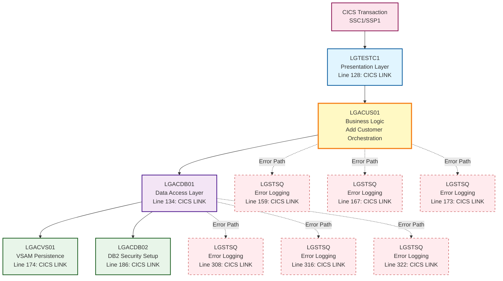

# LGACUS01 Program Call Graph

**Generated:** 2026-06-15  
**Program:** LGACUS01 (Add Customer Business Logic)  
**Analysis Type:** Local Database Query

---

## Executive Summary

[`LGACUS01`](../../base/src/lgacus01.cbl) is a business logic orchestration program in the customer management layer. It validates incoming requests, coordinates customer addition operations, and manages error handling. The program sits between the presentation layer ([`LGTESTC1`](../../base/src/lgtestc1.cbl)) and the data access layer ([`LGACDB01`](../../base/src/lgacdb01.cbl)).

**Key Characteristics:**
- **Layer:** Business Logic / Orchestration
- **Primary Function:** Customer Addition Workflow
- **Call Depth:** 3 levels (presentation → business → data access)
- **Error Handling:** Centralized via [`LGSTSQ`](../../base/src/lgstsq.cbl)

---

## Visual Call Graph



---

## Detailed Call Analysis

### 1. Inbound Calls (Programs Calling LGACUS01)

| Calling Program | Statement Type | Line | Purpose |
|----------------|----------------|------|---------|
| [`LGTESTC1`](../../base/src/lgtestc1.cbl:128) | CICS: LINK | 128 | Presentation layer invokes business logic after validating and normalizing customer input data |

**Context:** [`LGTESTC1`](../../base/src/lgtestc1.cbl) is the presentation layer program that:
- Handles BMS map interactions
- Validates user input (replaces low-values with spaces, uppercases postcode)
- Normalizes data before passing to business logic
- Is invoked directly by CICS transactions (SSC1 for customer operations)

### 2. Outbound Calls (Programs Called by LGACUS01)

| Called Program | Statement Type | Line | Purpose |
|---------------|----------------|------|---------|
| [`LGACDB01`](../../base/src/lgacdb01.cbl) | CICS: DYNAMIC_LINK | 134 | Primary data access program for customer DB2 operations |
| [`LGSTSQ`](../../base/src/lgstsq.cbl) | CICS: LINK | 159 | Error logging - writes error message to temporary storage queue |
| [`LGSTSQ`](../../base/src/lgstsq.cbl) | CICS: LINK | 167 | Error logging - writes commarea data (< 91 bytes) to queue |
| [`LGSTSQ`](../../base/src/lgstsq.cbl) | CICS: LINK | 173 | Error logging - writes commarea data (90 bytes) to queue |

**Key Observations:**
- **Single Business Operation:** [`LGACUS01`](../../base/src/lgacus01.cbl:134) makes only one business call to [`LGACDB01`](../../base/src/lgacdb01.cbl), maintaining clean separation of concerns
- **Error Handling Pattern:** Multiple calls to [`LGSTSQ`](../../base/src/lgstsq.cbl) handle different error scenarios with appropriate data logging
- **COMMAREA Length:** Passes 32,500 bytes to [`LGACDB01`](../../base/src/lgacdb01.cbl:136), allowing for oversized COMMAREA pattern

### 3. Second-Level Calls (Programs Called by LGACDB01)

| Called Program | Statement Type | Line | Purpose |
|---------------|----------------|------|---------|
| [`LGACVS01`](../../base/src/lgacvs01.cbl) | CICS: DYNAMIC_LINK | 174 | VSAM file operations for customer data persistence |
| [`LGACDB02`](../../base/src/lgacdb02.cbl) | CICS: DYNAMIC_LINK | 186 | DB2 operations for customer security credential setup |
| [`LGSTSQ`](../../base/src/lgstsq.cbl) | CICS: LINK | 308 | Error logging for DB2/VSAM failures |
| [`LGSTSQ`](../../base/src/lgstsq.cbl) | CICS: LINK | 316 | Error logging for commarea data (< 91 bytes) |
| [`LGSTSQ`](../../base/src/lgstsq.cbl) | CICS: LINK | 322 | Error logging for commarea data (90 bytes) |

**Architecture Note:** The two-phase commit pattern is demonstrated here:
- [`LGACVS01`](../../base/src/lgacvs01.cbl) handles VSAM persistence
- [`LGACDB02`](../../base/src/lgacdb02.cbl) handles DB2 security setup
- Both must succeed for transaction completion

---

## Call Flow Narrative

### Normal Flow (Success Path)

1. **Transaction Entry:** CICS transaction (SSC1) invokes [`LGTESTC1`](../../base/src/lgtestc1.cbl)
2. **Presentation Layer:** [`LGTESTC1`](../../base/src/lgtestc1.cbl:128) validates input, normalizes data, and LINKs to [`LGACUS01`](../../base/src/lgacus01.cbl)
3. **Business Logic Layer:** [`LGACUS01`](../../base/src/lgacus01.cbl) performs:
   - COMMAREA validation (lines 95-115)
   - Return code initialization (line 102)
   - Policy count initialization (line 103)
   - Length validation against required size
4. **Data Access Layer:** [`LGACUS01`](../../base/src/lgacus01.cbl:134) LINKs to [`LGACDB01`](../../base/src/lgacdb01.cbl) with full COMMAREA
5. **Persistence Layer:** [`LGACDB01`](../../base/src/lgacdb01.cbl) coordinates:
   - Customer number generation (Named Counter Service or DB2 identity)
   - VSAM write via [`LGACVS01`](../../base/src/lgacvs01.cbl:174)
   - Security credential setup via [`LGACDB02`](../../base/src/lgacdb02.cbl:186)
6. **Return Path:** Control returns through layers with populated [`CA-CUSTOMER-NUM`](../../bobz/DD.json) and [`CA-RETURN-CODE`](../../bobz/DD.json)

### Error Flow (Exception Path)

1. **No COMMAREA:** If EIBCALEN = 0, [`LGACUS01`](../../base/src/lgacus01.cbl:95-98) writes error via [`LGSTSQ`](../../base/src/lgstsq.cbl:159) and ABENDs with 'LGCA'
2. **Invalid Length:** If COMMAREA too short, [`LGACUS01`](../../base/src/lgacus01.cbl:112-115) sets [`CA-RETURN-CODE`](../../bobz/DD.json) = '98' and returns
3. **DB2/VSAM Errors:** [`LGACDB01`](../../base/src/lgacdb01.cbl) logs errors via [`LGSTSQ`](../../base/src/lgstsq.cbl:308,316,322) and sets [`CA-RETURN-CODE`](../../bobz/DD.json) = '90'

---

## Data Flow Analysis

### COMMAREA Structure (from [`lgcmarea.cpy`](../../base/src/lgcmarea.cpy))

The [`DFHCOMMAREA`](../../bobz/DD.json) serves as the stable contract across all layers:

**Header Section (18 bytes):**
- [`CA-REQUEST-ID`](../../base/src/lgcmarea.cpy): Request routing identifier
- [`CA-RETURN-CODE`](../../bobz/DD.json): Operation result ('00'=success, '90'=SQL error, '98'=invalid length)
- [`CA-CUSTOMER-NUM`](../../bobz/DD.json): Generated customer identifier (output)
- [`CA-NUM-POLICIES`](../../bobz/DD.json): Policy count (initialized to '00')

**Customer Data Section (from [`lgpolicy.cpy`](../../base/src/lgpolicy.cpy)):**
- [`CA-FIRST-NAME`](../../bobz/DD.json), [`CA-LAST-NAME`](../../bobz/DD.json): Customer identity
- [`CA-DOB`](../../bobz/DD.json): Date of birth for age verification
- [`CA-HOUSE-NAME`](../../bobz/DD.json), [`CA-HOUSE-NUM`](../../bobz/DD.json), [`CA-POSTCODE`](../../bobz/DD.json): Address components
- [`CA-PHONE-MOBILE`](../../bobz/DD.json), [`CA-PHONE-HOME`](../../bobz/DD.json): Contact information
- [`CA-EMAIL-ADDRESS`](../../bobz/DD.json): Digital communication channel

### Data Transformations

1. **Presentation → Business:** [`LGTESTC1`](../../base/src/lgtestc1.cbl) normalizes:
   - Replaces low-values with spaces
   - Uppercases [`CA-POSTCODE`](../../bobz/DD.json)
   
2. **Business → Data Access:** [`LGACUS01`](../../base/src/lgacus01.cbl) validates:
   - COMMAREA length >= [`WS-REQUIRED-CA-LEN`](../../bobz/DD.json)
   - Initializes [`CA-RETURN-CODE`](../../bobz/DD.json) and [`CA-NUM-POLICIES`](../../bobz/DD.json)

3. **Data Access → Persistence:** [`LGACDB01`](../../base/src/lgacdb01.cbl) generates:
   - [`CA-CUSTOMER-NUM`](../../bobz/DD.json) via Named Counter Service or DB2 identity
   - Security credentials via [`LGACDB02`](../../base/src/lgacdb02.cbl)

---

## Architecture Patterns

### 1. Layered Architecture

```
┌─────────────────────────────────────┐
│   Presentation Layer (LGTESTC1)    │  ← User interaction, validation
├─────────────────────────────────────┤
│   Business Logic (LGACUS01)        │  ← Orchestration, validation
├─────────────────────────────────────┤
│   Data Access (LGACDB01)           │  ← DB2/VSAM coordination
├─────────────────────────────────────┤
│   Persistence (LGACVS01, LGACDB02) │  ← Physical storage
└─────────────────────────────────────┘
```

**Benefits:**
- Clear separation of concerns
- Testable layers
- Maintainable codebase
- Reusable components

### 2. Error Handling Strategy

**Centralized Logging:** All layers use [`LGSTSQ`](../../base/src/lgstsq.cbl) for consistent error logging:
- Timestamp formatting via CICS ASKTIME/FORMATTIME
- Program identification in error messages
- COMMAREA data capture for diagnostics
- Temporary storage queue persistence

**Return Code Convention:**
- `'00'` = Success
- `'90'` = SQL/Database error
- `'98'` = Invalid COMMAREA length

### 3. Two-Phase Commit Pattern

[`LGACDB01`](../../base/src/lgacdb01.cbl) demonstrates intentional two-phase commit:
- VSAM write via [`LGACVS01`](../../base/src/lgacvs01.cbl)
- DB2 write via [`LGACDB02`](../../base/src/lgacdb02.cbl)
- Both must succeed for transaction completion
- Rollback coordination if either fails

---

## Performance Considerations

### Call Overhead

| Layer | Calls | Overhead |
|-------|-------|----------|
| Presentation → Business | 1 | Minimal (single LINK) |
| Business → Data Access | 1 | Minimal (single LINK) |
| Data Access → Persistence | 2 | Moderate (VSAM + DB2) |
| Error Logging | 0-3 per layer | Variable (only on errors) |

**Total Normal Path:** 4 CICS LINKs (LGTESTC1 → LGACUS01 → LGACDB01 → LGACVS01/LGACDB02)

### COMMAREA Size

- **Passed Size:** 32,500 bytes (oversized pattern)
- **Actual Usage:** ~18 bytes header + customer data length
- **Rationale:** Allows for future expansion without interface changes

---

## Dependencies

### Copybooks

| Copybook | Purpose | Used By |
|----------|---------|---------|
| [`lgcmarea.cpy`](../../base/src/lgcmarea.cpy) | COMMAREA structure definition | All programs in call chain |
| [`lgpolicy.cpy`](../../base/src/lgpolicy.cpy) | Customer data structure, [`WS-CUSTOMER-LEN`](../../bobz/DD.json) | [`LGACUS01`](../../base/src/lgacus01.cbl), [`LGACDB01`](../../base/src/lgacdb01.cbl) |

### External Resources

| Resource | Type | Access Pattern |
|----------|------|----------------|
| GENACUSTNUM | Named Counter | Read/Increment (customer number generation) |
| CUSTOMER table | DB2 | INSERT (via [`LGACDB01`](../../base/src/lgacdb01.cbl)) |
| CUSTSEC table | DB2 | INSERT (via [`LGACDB02`](../../base/src/lgacdb02.cbl)) |
| Customer VSAM | KSDS | WRITE (via [`LGACVS01`](../../base/src/lgacvs01.cbl)) |
| Error Queue | TSQ | WRITE (via [`LGSTSQ`](../../base/src/lgstsq.cbl)) |

---

## Testing Implications

### Unit Testing

**LGACUS01 Test Scenarios:**
1. Valid COMMAREA with correct length → Success path
2. Zero COMMAREA length → ABEND 'LGCA'
3. Insufficient COMMAREA length → Return code '98'
4. Valid request with DB2 failure → Return code '90'

**Mock Requirements:**
- [`LGACDB01`](../../base/src/lgacdb01.cbl) stub for data access simulation
- [`LGSTSQ`](../../base/src/lgstsq.cbl) stub for error logging verification

### Integration Testing

**Full Call Chain Test:**
1. Invoke [`LGTESTC1`](../../base/src/lgtestc1.cbl) with customer data
2. Verify [`LGACUS01`](../../base/src/lgacus01.cbl) validation logic
3. Confirm [`LGACDB01`](../../base/src/lgacdb01.cbl) persistence
4. Validate [`CA-CUSTOMER-NUM`](../../bobz/DD.json) generation
5. Check VSAM and DB2 records created

**Transaction Testing:**
- Use SSC1 transaction for end-to-end flow
- Verify two-phase commit behavior
- Test rollback scenarios

---

## Maintenance Considerations

### Impact of Changes

**Modifying LGACUS01:**
- **Low Impact:** Internal validation logic changes
- **Medium Impact:** COMMAREA length validation changes
- **High Impact:** Adding new called programs or changing call sequence

**Modifying COMMAREA Structure:**
- **Critical Impact:** Affects all programs in call chain
- **Mitigation:** Use copybook versioning, maintain backward compatibility

### Extension Points

1. **Additional Validation:** Add business rules in [`LGACUS01`](../../base/src/lgacus01.cbl) before calling [`LGACDB01`](../../base/src/lgacdb01.cbl)
2. **Audit Logging:** Insert audit call after successful customer creation
3. **Event Publishing:** Add event notification after persistence layer

---

## Related Documentation

- **Architecture Overview:** [`base/Architecture.md`](../../base/Architecture.md)
- **Program Reference:** [`base/Reference.md`](../../base/Reference.md)
- **Testing Guide:** [`base/Testing.md`](../../base/Testing.md)
- **Program Documentation:** [`docs/program-documents/LGACUS01.md`](../program-documents/LGACUS01.md)
- **Data Dictionary:** [`bobz/DD.json`](../../bobz/DD.json)

---

## Revision History

| Date | Version | Changes |
|------|---------|---------|
| 2026-06-15 | 1.0 | Initial call graph generation from local database analysis |
