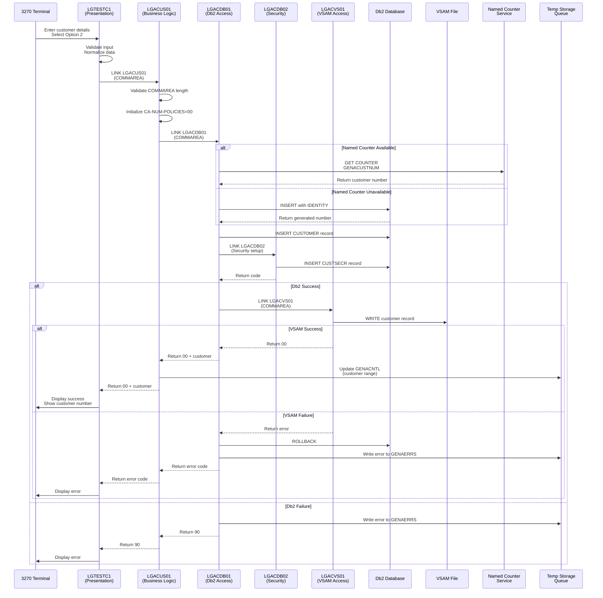

# Customer Add Transaction - Complete Data Flow

## Overview

This document provides a comprehensive trace of the customer add transaction flow, from user input through all program layers to final data persistence. Understanding this flow is essential for maintenance, troubleshooting, and modernization efforts.

**Transaction**: SSC1 (Customer Menu)  
**Operation**: Add Customer (Option 2)  
**Entry Program**: LGTESTC1  
**Last Updated**: 2026-06-24

---

## Flow Summary



---

## Detailed Step-by-Step Flow

### Phase 1: User Input & Presentation Layer

#### Step 1.1: User Enters Data
**Location**: 3270 Terminal  
**Screen**: Customer Menu (SSMAP)

**User Actions**:
1. Runs transaction `SSC1`
2. Enters customer details:
   - First Name
   - Last Name
   - Date of Birth
   - House Name/Number
   - Postcode
   - Mobile Phone
   - Home Phone
   - Email Address
3. Selects Option 2 (Add Customer)
4. Presses ENTER

#### Step 1.2: LGTESTC1 Receives Input
**Program**: [`LGTESTC1`](../../base/src/lgtestc1.cbl)  
**Layer**: Presentation

**Processing**:
1. Receives control from CICS
2. Reads BMS map data into working storage
3. Identifies operation: Option 2 = Add Customer

**Code Reference**:
```cobol
* Determine which option was selected
EVALUATE TRUE
    WHEN OPTN2I = '2'
        PERFORM ADD-CUSTOMER
    ...
END-EVALUATE
```

#### Step 1.3: Input Validation & Normalization
**Program**: [`LGTESTC1`](../../base/src/lgtestc1.cbl:125-127)  
**Purpose**: Ensure data quality before business logic

**Normalization Rules** (per [`AGENTS.md`](../../AGENTS.md:14)):
1. **Replace Low-Values**: All x'00' bytes → spaces (x'40')
2. **Uppercase Postcode**: Convert to uppercase for consistency

**Code Reference**:
```cobol
* Replace low-values with spaces
INSPECT CA-CUSTOMER-REQUEST 
    REPLACING ALL LOW-VALUES BY SPACES

* Uppercase the postcode
MOVE FUNCTION UPPER-CASE(CA-POSTCODE) TO CA-POSTCODE
```

**Business Rationale**: Prevents database issues with null characters and ensures postcode consistency for geographic analysis.

#### Step 1.4: Build COMMAREA
**Program**: [`LGTESTC1`](../../base/src/lgtestc1.cbl)  
**Structure**: Defined in [`lgcmarea.cpy`](../../base/src/lgcmarea.cpy)

**COMMAREA Contents**:
```
Header (18 bytes):
  - CA-REQUEST-ID: '01ACUS' (Add Customer)
  - CA-RETURN-CODE: '00' (initialized)
  - CA-CUSTOMER-NUM: Spaces (will be populated)
  - CA-POLICY-NUM: Spaces (not used)
  - CA-NUM-POLICIES: Spaces (will be set to '00')

Body (Customer Data):
  - CA-FIRST-NAME: User input
  - CA-LAST-NAME: User input
  - CA-DOB: User input
  - CA-HOUSE-NAME: User input
  - CA-HOUSE-NUM: User input
  - CA-POSTCODE: User input (normalized)
  - CA-PHONE-MOBILE: User input
  - CA-PHONE-HOME: User input
  - CA-EMAIL-ADDRESS: User input
```

#### Step 1.5: Link to Business Logic
**Program**: [`LGTESTC1`](../../base/src/lgtestc1.cbl)  
**Target**: LGACUS01

**CICS Command**:
```cobol
EXEC CICS LINK
    PROGRAM('LGACUS01')
    COMMAREA(DFHCOMMAREA)
    LENGTH(WS-COMMAREA-LENGTH)
END-EXEC
```

**Control Transfer**: Presentation → Business Logic

---

### Phase 2: Business Logic Layer

#### Step 2.1: LGACUS01 Receives Control
**Program**: [`LGACUS01`](../../base/src/lgacus01.cbl)  
**Layer**: Business Logic  
**Documentation**: [`docs/program-documents/LGACUS01.md`](../program-documents/LGACUS01.md)

**Initial Processing**:
1. Receives COMMAREA from LGTESTC1
2. Validates COMMAREA length
3. Initializes diagnostic header

#### Step 2.2: COMMAREA Length Validation
**Program**: [`LGACUS01`](../../base/src/lgacus01.cbl)  
**Business Rule**: CM-003 (per [`BUSINESS_RULES.md`](../BUSINESS_RULES.md))

**Validation Logic**:
```cobol
* Calculate required length
COMPUTE WS-REQUIRED-CA-LEN = 
    WS-CA-HEADER-LEN + WS-CUSTOMER-LEN

* Validate actual length
IF EIBCALEN < WS-REQUIRED-CA-LEN
    MOVE '98' TO CA-RETURN-CODE
    * Log error and return
END-IF
```

**Required Length**:
- Header: 18 bytes (WS-CA-HEADER-LEN)
- Customer Data: From LGPOLICY copybook (WS-CUSTOMER-LEN)
- Total: Header + Customer Data

**Error Handling**:
- Return Code: '98' = Invalid COMMAREA length
- Error logged to temporary storage queue via LGSTSQ
- Control returns to presentation layer

#### Step 2.3: Initialize Policy Count
**Program**: [`LGACUS01`](../../base/src/lgacus01.cbl:103)  
**Business Rule**: CM-005 (per [`BUSINESS_RULES.md`](../BUSINESS_RULES.md:59-63))

**Processing**:
```cobol
MOVE '00' TO CA-NUM-POLICIES
```

**Business Rationale**: New customers start with zero policies. This field tracks the customer's policy portfolio.

#### Step 2.4: Link to Data Access Layer
**Program**: [`LGACUS01`](../../base/src/lgacus01.cbl)  
**Target**: LGACDB01

**CICS Command**:
```cobol
EXEC CICS LINK
    PROGRAM('LGACDB01')
    COMMAREA(DFHCOMMAREA)
    LENGTH(LENGTH OF DFHCOMMAREA)
END-EXEC
```

**Control Transfer**: Business Logic → Data Access (Db2)

---

### Phase 3: Data Access Layer - Db2

#### Step 3.1: LGACDB01 Receives Control
**Program**: [`LGACDB01`](../../base/src/lgacdb01.cbl)  
**Layer**: Data Access (Db2)  
**Purpose**: Persist customer to Db2 database

**Initial Processing**:
1. Receives COMMAREA from LGACUS01
2. Determines customer number generation strategy
3. Prepares SQL statements

#### Step 3.2: Customer Number Generation
**Program**: [`LGACDB01`](../../base/src/lgacdb01.cbl:199-211)  
**Business Rule**: CM-001 (per [`BUSINESS_RULES.md`](../BUSINESS_RULES.md:25-31))

**Strategy Selection**:
```cobol
IF LGAC-NCS = 'ON'
    * Use Named Counter Service
    PERFORM GET-CUSTOMER-NUMBER-NCS
ELSE
    * Use Db2 Identity Column
    PERFORM GET-CUSTOMER-NUMBER-DB2
END-IF
```

**Option A: Named Counter Service** (Preferred)
```cobol
EXEC CICS GET COUNTER
    COUNTER('GENACUSTNUM')
    POOL('GENA')
    VALUE(LastCustNum)
END-EXEC

MOVE LastCustNum TO CA-CUSTOMER-NUM
```

**Benefits**:
- High performance
- Sysplex-wide uniqueness
- No database round-trip

**Option B: Db2 Identity Column** (Fallback)
```cobol
* Insert with IDENTITY column
EXEC SQL
    INSERT INTO CUSTOMER (...)
    VALUES (DEFAULT, ...)
END-EXEC

* Retrieve generated value
EXEC SQL
    VALUES (IDENTITY_VAL_LOCAL())
    INTO :DB2-CUSTOMERNUM-INT
END-EXEC

MOVE DB2-CUSTOMERNUM-INT TO CA-CUSTOMER-NUM
```

**Benefits**:
- No coupling facility required
- Standard Db2 feature
- Automatic sequence management

#### Step 3.3: Insert Customer Record
**Program**: [`LGACDB01`](../../base/src/lgacdb01.cbl)  
**Table**: CUSTOMER

**SQL Statement**:
```sql
INSERT INTO CUSTOMER (
    CUSTOMERNUMBER,
    FIRSTNAME,
    LASTNAME,
    DATEOFBIRTH,
    HOUSENAME,
    HOUSENUMBER,
    POSTCODE,
    PHONEMOBILE,
    PHONEHOME,
    EMAILADDRESS,
    NUMPOLICIES
) VALUES (
    :CA-CUSTOMER-NUM,
    :CA-FIRST-NAME,
    :CA-LAST-NAME,
    :CA-DOB,
    :CA-HOUSE-NAME,
    :CA-HOUSE-NUM,
    :CA-POSTCODE,
    :CA-PHONE-MOBILE,
    :CA-PHONE-HOME,
    :CA-EMAIL-ADDRESS,
    :CA-NUM-POLICIES
)
```

**Data Dictionary References** (per [`bobz/DD.json`](../../bobz/DD.json)):
- `CA-FIRST-NAME`: Customer's first name
- `CA-LAST-NAME`: Customer's last name
- `CA-DOB`: Date of birth for age verification
- `CA-POSTCODE`: Postal code for geographic analysis
- `CA-NUM-POLICIES`: Policy count (initialized to '00')

#### Step 3.4: Setup Customer Security
**Program**: [`LGACDB01`](../../base/src/lgacdb01.cbl:179-189)  
**Target**: LGACDB02  
**Business Rule**: CM-004 (per [`BUSINESS_RULES.md`](../BUSINESS_RULES.md:49-55))

**Prepare Security Data**:
```cobol
MOVE CA-CUSTOMER-NUM TO D2-CUSTOMER-NUM
MOVE '5732fec825535eeafb8fac50fee3a8aa' TO D2-CUSTSECR-PASS
MOVE 'N' TO D2-CUSTSECR-STATE
```

**Link to Security Program**:
```cobol
EXEC CICS LINK
    PROGRAM('LGACDB02')
    COMMAREA(D2-COMMAREA)
    LENGTH(LENGTH OF D2-COMMAREA)
END-EXEC
```

**LGACDB02 Processing**:
```sql
INSERT INTO CUSTSECR (
    CUSTOMERNUMBER,
    CUSTOMERPASSWORD,
    SECURITYCOUNT,
    SECURITYSTATE
) VALUES (
    :D2-CUSTOMER-NUM,
    :D2-CUSTSECR-PASS,
    0000,
    :D2-CUSTSECR-STATE
)
```

**Business Rationale**: Establishes baseline security credentials for new customer accounts.

#### Step 3.5: Error Handling - Db2
**Program**: [`LGACDB01`](../../base/src/lgacdb01.cbl)

**SQL Error Detection**:
```cobol
IF SQLCODE NOT = 0
    MOVE '90' TO CA-RETURN-CODE
    PERFORM WRITE-ERROR-MESSAGE
    EXEC CICS RETURN END-EXEC
END-IF
```

**Error Logging**:
```cobol
PERFORM WRITE-ERROR-MESSAGE
    * Builds CA-ERROR-MSG with COMMAREA data
    * Links to LGSTSQ to write to GENAERRS queue
```

**Return Codes**:
- '00' = Success
- '90' = SQL error (SQLCODE not zero)

---

### Phase 4: Data Access Layer - VSAM

#### Step 4.1: Link to VSAM Program
**Program**: [`LGACDB01`](../../base/src/lgacdb01.cbl)  
**Target**: LGACVS01  
**Condition**: Only if Db2 insert succeeded

**CICS Command**:
```cobol
IF CA-RETURN-CODE = '00'
    EXEC CICS LINK
        PROGRAM('LGACVS01')
        COMMAREA(DFHCOMMAREA)
        LENGTH(LENGTH OF DFHCOMMAREA)
    END-EXEC
END-IF
```

#### Step 4.2: LGACVS01 Receives Control
**Program**: [`LGACVS01`](../../base/src/lgacvs01.cbl)  
**Layer**: Data Access (VSAM)  
**Purpose**: Persist customer to VSAM file

**File**: KSDSCUST (Customer VSAM file)  
**Key**: First 10 characters (customer number)

#### Step 4.3: Write VSAM Record
**Program**: [`LGACVS01`](../../base/src/lgacvs01.cbl)

**CICS Command**:
```cobol
EXEC CICS WRITE
    FILE('KSDSCUST')
    FROM(CUSTOMER-RECORD)
    RIDFLD(CA-CUSTOMER-NUM)
    LENGTH(LENGTH OF CUSTOMER-RECORD)
END-EXEC
```

**Record Structure**:
- Key: 10-digit customer number
- Data: Complete customer record (225 bytes)
- Format: Fixed-length, matches Db2 structure

#### Step 4.4: Error Handling - VSAM
**Program**: [`LGACVS01`](../../base/src/lgacvs01.cbl)

**VSAM Error Detection**:
```cobol
IF EIBRESP NOT = DFHRESP(NORMAL)
    MOVE '91' TO CA-RETURN-CODE
    * Log error
    EXEC CICS RETURN END-EXEC
END-IF
```

**Return Codes**:
- '00' = Success
- '91' = VSAM error

**Critical**: If VSAM fails, Db2 transaction will be rolled back (two-phase commit).

---

### Phase 5: Two-Phase Commit

#### Step 5.1: Commit Coordination
**Coordinator**: CICS Transaction Manager  
**Participants**: Db2, VSAM

**Commit Protocol**:
1. **Prepare Phase**:
   - Db2: INSERT executed, locks held, ready to commit
   - VSAM: WRITE executed, ready to commit

2. **Decision Phase**:
   - If both prepared successfully → COMMIT
   - If either failed → ROLLBACK

3. **Completion Phase**:
   - Db2: Commit or rollback transaction
   - VSAM: Finalize or undo write
   - Release all locks

#### Step 5.2: Success Scenario
**Condition**: Both Db2 and VSAM operations succeeded

**Actions**:
1. CICS commits Db2 transaction
2. CICS finalizes VSAM write
3. Customer record exists in both systems
4. CA-RETURN-CODE = '00'
5. CA-CUSTOMER-NUM contains new customer number

#### Step 5.3: Failure Scenario
**Condition**: Either Db2 or VSAM operation failed

**Actions**:
1. CICS rolls back Db2 transaction
2. CICS undoes VSAM write (if it succeeded)
3. Customer record does NOT exist in either system
4. CA-RETURN-CODE = '90' (Db2 error) or '91' (VSAM error)
5. Error logged to GENAERRS temporary storage queue

**Business Impact**: Data consistency maintained - customer exists in both systems or neither.

---

### Phase 6: Post-Processing

#### Step 6.1: Update Control Queue
**Program**: [`LGACUS01`](../../base/src/lgacus01.cbl)  
**Condition**: Only if customer add succeeded (CA-RETURN-CODE = '00')

**Purpose**: Track customer number ranges for workload simulation

**Temporary Storage Queue**: GENACNTL

**Processing**:
1. Read current control record
2. Update customer number range
3. Write updated control record

**Note**: This is not a best practice but provided for testing automation (per [`AGENTS.md`](../../AGENTS.md:16)).

#### Step 6.2: Return to Business Logic
**Program**: LGACDB01 → LGACUS01  
**Mechanism**: EXEC CICS RETURN

**COMMAREA State**:
- CA-RETURN-CODE: '00' (success) or error code
- CA-CUSTOMER-NUM: New customer number (if successful)
- CA-NUM-POLICIES: '00'
- All customer data: Unchanged

#### Step 6.3: Return to Presentation Layer
**Program**: LGACUS01 → LGTESTC1  
**Mechanism**: EXEC CICS RETURN

**COMMAREA State**: Same as Step 6.2

---

### Phase 7: User Response

#### Step 7.1: LGTESTC1 Processes Return
**Program**: [`LGTESTC1`](../../base/src/lgtestc1.cbl)  
**Layer**: Presentation

**Processing**:
```cobol
IF CA-RETURN-CODE = '00'
    * Success - display customer number
    MOVE CA-CUSTOMER-NUM TO CUSTNOO
    MOVE 'Customer added successfully' TO MESSAGEO
ELSE
    * Error - display error message
    MOVE 'Customer add failed' TO MESSAGEO
    MOVE CA-RETURN-CODE TO ERRCODEO
END-IF
```

#### Step 7.2: Display Results
**Program**: [`LGTESTC1`](../../base/src/lgtestc1.cbl)  
**Screen**: Customer Menu (SSMAP)

**Success Display**:
- Customer Number: New 10-digit number
- Message: "Customer added successfully"
- All input fields: Cleared or retained

**Error Display**:
- Error Code: '90', '91', or '98'
- Message: "Customer add failed"
- Input fields: Retained for correction

#### Step 7.3: Transaction Complete
**Status**: Transaction ends, control returns to CICS

**Final State**:
- **Success**: Customer exists in Db2 and VSAM with unique number
- **Failure**: No customer record created, error logged

---

## Error Scenarios

### Scenario 1: Invalid COMMAREA Length
**Detection Point**: LGACUS01 (Business Logic)  
**Return Code**: '98'  
**Impact**: Transaction rejected before database access  
**Recovery**: Presentation layer issue - check COMMAREA structure

### Scenario 2: Db2 Insert Failure
**Detection Point**: LGACDB01 (Data Access)  
**Return Code**: '90'  
**Impact**: No customer created in either system  
**Recovery**: Check Db2 logs, verify database connectivity

**Common Causes**:
- Db2 connection failure
- Table space full
- Constraint violation
- SQL syntax error

### Scenario 3: VSAM Write Failure
**Detection Point**: LGACVS01 (Data Access)  
**Return Code**: '91'  
**Impact**: Db2 transaction rolled back, no customer created  
**Recovery**: Check VSAM file status, verify file definitions

**Common Causes**:
- File not open
- Duplicate key (should not happen with unique numbers)
- File full
- I/O error

### Scenario 4: Named Counter Unavailable
**Detection Point**: LGACDB01 (Data Access)  
**Return Code**: N/A (automatic fallback)  
**Impact**: Uses Db2 identity column instead  
**Recovery**: Automatic - no user impact

**Fallback Behavior**:
- Seamless transition to Db2 identity generation
- Slightly slower (extra database round-trip)
- Still guarantees unique customer numbers

---

## Performance Characteristics

### Typical Response Times

| Scenario | Response Time | Notes |
|----------|--------------|-------|
| **Success (NCS)** | 150-200ms | Named counter + Db2 + VSAM |
| **Success (Db2 Identity)** | 200-250ms | Extra Db2 round-trip |
| **Validation Error** | <50ms | Rejected at business logic |
| **Db2 Error** | 100-150ms | Db2 timeout + error logging |
| **VSAM Error** | 150-200ms | Db2 + VSAM + rollback |

### Resource Utilization

**Database**:
- 2 Db2 INSERTs (CUSTOMER + CUSTSECR)
- 1 Db2 SELECT (if using identity column)
- Transaction log entries

**VSAM**:
- 1 WRITE operation (225 bytes)
- File buffer usage

**CICS**:
- 5 program loads (if not cached)
- 4 LINK operations
- COMMAREA memory (varies by size)
- Temporary storage queue updates

**Named Counter** (if used):
- 1 GET COUNTER operation
- Coupling facility structure access

---

## Data Dictionary Integration

### Key Variables (from [`bobz/DD.json`](../../bobz/DD.json))

**Customer Identification**:
- `CA-CUSTOMER-NUM`: Unique 10-digit customer identifier
- `DB2-CUSTOMERNUM-INT`: Integer representation for Db2 identity

**Customer Demographics**:
- `CA-FIRST-NAME`: Customer's first name for identification
- `CA-LAST-NAME`: Customer's last name for identification
- `CA-DOB`: Date of birth for age verification and demographics

**Contact Information**:
- `CA-PHONE-MOBILE`: Primary contact method
- `CA-PHONE-HOME`: Alternative contact method
- `CA-EMAIL-ADDRESS`: Digital communications channel

**Address Information**:
- `CA-HOUSE-NAME`: Residence name (e.g., 'Rose Cottage')
- `CA-HOUSE-NUM`: Street number
- `CA-POSTCODE`: Critical for location-based services and geographic analysis

**Control Fields**:
- `CA-RETURN-CODE`: Success/error indicator (00=success, 90=SQL error, 91=VSAM error, 98=invalid length)
- `CA-NUM-POLICIES`: Policy count (initialized to '00' for new customers)

**Security Fields**:
- `D2-CUSTSECR-PASS`: Initial password hash for authentication
- `D2-CUSTSECR-STATE`: Security state indicator (N=New)

---

## Testing Scenarios

### Test Case 1: Successful Add (Named Counter)
**Preconditions**:
- Named counter service available
- Db2 connected
- VSAM file open

**Steps**:
1. Run SSC1
2. Enter valid customer data
3. Select option 2
4. Press ENTER

**Expected Results**:
- CA-RETURN-CODE = '00'
- New customer number displayed
- Record in Db2 CUSTOMER table
- Record in VSAM KSDSCUST file
- Record in Db2 CUSTSECR table

### Test Case 2: Successful Add (Db2 Identity)
**Preconditions**:
- Named counter service unavailable
- Db2 connected
- VSAM file open

**Steps**: Same as Test Case 1

**Expected Results**: Same as Test Case 1 (slightly slower)

### Test Case 3: Invalid COMMAREA
**Preconditions**: Modify LGTESTC1 to send truncated COMMAREA

**Expected Results**:
- CA-RETURN-CODE = '98'
- Error message displayed
- No database access
- Error logged to GENAERRS

### Test Case 4: Db2 Unavailable
**Preconditions**: Stop Db2 or disable connection

**Expected Results**:
- CA-RETURN-CODE = '90'
- Error message displayed
- No records created
- Error logged to GENAERRS

### Test Case 5: VSAM File Closed
**Preconditions**: Close KSDSCUST file

**Expected Results**:
- CA-RETURN-CODE = '91'
- Error message displayed
- Db2 transaction rolled back
- No records in either system

---

## Troubleshooting Guide

### Problem: Customer Not Created
**Symptoms**: Error message, no customer number

**Diagnosis Steps**:
1. Check CA-RETURN-CODE:
   - '98' → COMMAREA length issue
   - '90' → Db2 problem
   - '91' → VSAM problem

2. Check GENAERRS temporary storage queue:
   ```
   CEBR GENAERRS
   ```

3. Check Db2 logs for SQL errors

4. Verify VSAM file status:
   ```
   CEMT I FILE(KSDSCUST)
   ```

### Problem: Duplicate Customer Number
**Symptoms**: SQL error -803 (duplicate key)

**Diagnosis**:
- Named counter out of sync with database
- Manual data insertion bypassed counter

**Resolution**:
1. Reset named counter to max customer number + 1
2. Or use Db2 identity column exclusively

### Problem: Slow Response Time
**Symptoms**: Transaction takes >500ms

**Diagnosis Steps**:
1. Check if using Db2 identity (slower than NCS)
2. Check Db2 connection pool
3. Check VSAM buffer settings
4. Review Db2 query execution plan

**Optimization**:
- Enable named counter service
- Increase Db2 connection pool
- Tune VSAM buffers
- Add Db2 indexes if needed

---

## Modernization Considerations

### API Enablement
**Current**: 3270 terminal interface  
**Future**: RESTful API

**Proposed Flow**:
```
REST API Gateway
    ↓
LGACUS01 (reuse business logic)
    ↓
LGACDB01/LGACVS01 (reuse data access)
```

**Benefits**:
- Reuse existing business logic
- Maintain data integrity (two-phase commit)
- Gradual modernization path

### Microservices Extraction
**Candidate**: Customer Management Service

**Proposed Architecture**:
- Extract LGACUS01 business logic
- Wrap in microservice container
- Expose REST/GraphQL API
- Maintain Db2/VSAM integration initially
- Migrate to cloud database later

### Event-Driven Architecture
**Opportunity**: Customer Created Event

**Proposed Flow**:
1. Customer added successfully
2. Publish "CustomerCreated" event
3. Downstream systems subscribe:
   - Marketing automation
   - CRM integration
   - Analytics pipeline
   - Notification service

---

## Related Documentation

- **Program Documentation**: [`docs/program-documents/LGACUS01.md`](../program-documents/LGACUS01.md)
- **Business Rules**: [`docs/BUSINESS_RULES.md`](../BUSINESS_RULES.md)
- **Data Dictionary**: [`bobz/DD.json`](../../bobz/DD.json)
- **Architecture**: [`base/Architecture.md`](../../base/Architecture.md)
- **AGENTS Rules**: [`AGENTS.md`](../../AGENTS.md)

---

**Document Control**
- **Version**: 1.0
- **Created**: 2026-06-24
- **Last Updated**: 2026-06-24
- **Next Review**: 2026-07-24
- **Owner**: Technical Documentation Team